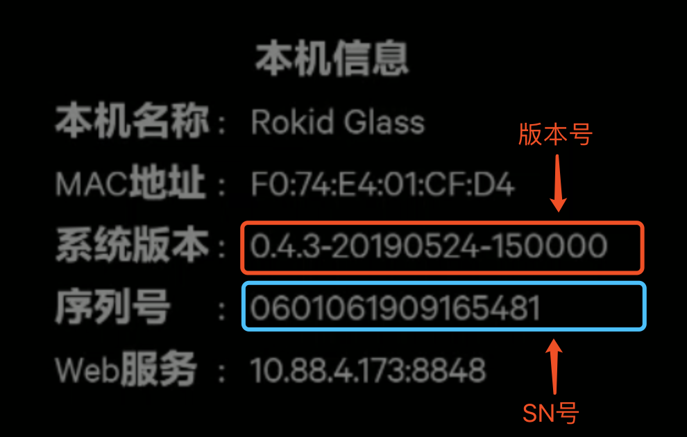

## 眼镜系统版本升级方法:

## 一、手动刷机
### 镜像下载链接
https://rokid-ota.oss-cn-hangzhou.aliyuncs.com/toB/Rokid_Glass/standard/full_image.zip

### 刷机步骤
1、解压zip包 
2、PC端USB连接glass 
3、cd到msm8998下目录 
4、./update.sh运行后自动完成刷机 

## 二、OTA升级 

### Step 1:信息查询
设置-->本机信息-->版本号、SN号，若版本号较低，则需要手动OTA升级	 
	 

### Step 2:OTA升级步骤	 

设置-->系统升级-->检查更新	 
备注：	 
1. 如未检测到新版本，需找相关人员确认在SN是否在升级列表中；	 
2. 需保证充电状态或电量在 50%以上!	 
	 

检测到新版本	 
	 

点击“更新”开始下载	 
	 

 升级成功，重启后生效。 	 原来额外安装在眼镜端的应用，如物体识别、绘本识别不受影响。	 
	 
 
