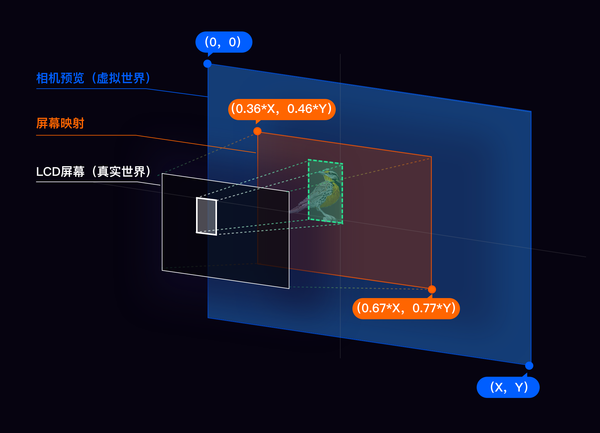
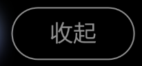
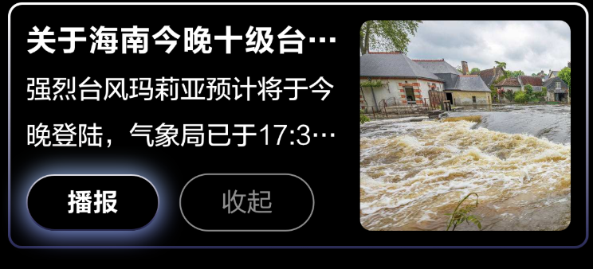

# Glass UI SDK
**Version: 1.0.0-SNAPSHOT**  

## 一、UI SDK介绍
---
### 1.1 概述
提供一套在Rokid Glass上开发应用的基础UI库,目前已经提供以下支持：  

**1. GlassAlignment**   
由于AR 眼镜特有的屏幕显示特性，在开发眼镜上的识别类应用时，     
需要对marked UI做一次align，以保证人眼看到的marked UI和真实世界对齐。

**2. GlassButton**   
Glass自定义的Button    

**3. GlassDialog**   
提供了一系列常用的对话框

## 二、集成说明
---
在根目录`build.gradle`中增加私有maven库：
``` gradle
maven {
    url 'http://mvnrepo.rokid-inc.com/nexus/content/repositories/snapshots/'
}

maven {
    url 'http://mvnrepo.rokid-inc.com/nexus/content/repositories/releases/'
}
```
### 2.1 Gradle依赖
``` gradle
implementation 'com.rokid.glass:ui:1.0.0-SNAPSHOT'
```

### 2.2 Demo
[Glass UI Demo](https://gitlab.rokid-inc.com/rokid-glass/glass-ui)

## 三、功能列表
---
### 3.1 RokidSystem
#### 3.1.1 getAlignmentRect
获取 glass 下调校过的 alignment 参数。   
Alignment概念：
Camera预览界面通过Glass显示屏幕进入人眼睛的映射过程，如图：



蓝色代表`CameraPreview`的画面（1280，720）   
绿色代表`CameraPreview`中物体的坐标（500，400）   
黄色代表人眼透过屏幕看到的场景，`getAlignmentRect`方法返回的Rect（463，330，863，556）就是该黄色区域坐标。   

//获取不同glass 下的alignment参数   
Public Rect getAlignmentRect();

物体映射到屏幕的显示坐标为：   
x =（500-463）/（863-463）* LCD_width   
y =（400-330）/（556-330）* LCD_height  

示例代码：   
```

```


### 3.2 GlassButton
Glass自定义的Button

`Focused`:  


`Normal`



#### 3.2.1 用法
``` xml
<com.rokid.glass.ui.button.GlassButton
    android:id="@+id/confirm_btn"
    style="@style/GlassButton"
    android:layout_width="@dimen/glass_button_width"
    android:layout_height="@dimen/glass_button_height"
    android:text="@string/confirm_text" />
```
### 3.3 GlassDialog
提供了一系列常用的对话框,通过不同Builder 来构建不同类型的对话框。
目前提供的Builder:
#### 3.3.1 NotificationDialogBuilder
通知栏通知（出现固定时间后消失）


|方法|含义|默认值
|---|---|---|
|setTitle|设置通知栏标题|null|
|setMessage|设置通知栏内容|null|
|setIconRes|设置通知icon||
|setDuration|设置通知栏消息时间(ms)|3000|

**示例代码**
``` java
GlassDialog notificationDialog = new GlassDialog.NotificationDialogBuilder(this)
            .setTitle(getString(R.string.notification_title))
            .setMessage(getString(R.string.notification_message))
            .setIconRes(R.mipmap.ic_launcher)
            .setDuration(3000)
            .create();
notificationDialog.show();
```


#### 3.3.2 SimpleVoiceDialogBuilder
纯语音通知


|方法|含义|默认值
|---|---|---|
|setTitle|设置标题|null|
|setConfirmText|设置确定按钮文字|确定|
|setCancelText|设置取消按钮文字|取消|
|setConfirmListener|设置Confirm监听||
|setCancelListener|设置Cancel监听||
|dynamicTitle|动态改变标题||
|dynamicConfirmText|动态改变确定按钮文字| |
|dynamicCustomConfirmView|自定义Confirm界面布局| - |

**示例代码**
``` java
GlassDialog simpleVoiceDialogBuilder = new GlassDialog.SimpleVoiceDialogBuilder(this)
            .setTitle(getString(R.string.voice_test))
            .setConfirmText(getString(R.string.voice_play))
            .setCancelText(getString(R.string.voice_collapse))
            .setConfirmListener(new GlassDialogListener() {
                @Override
                public void onClick(View view) {
                    Toast.makeText(MainActivity.this,
                            "Click Confirm", Toast.LENGTH_SHORT).show();

                    mSimpleVoiceDialogBuilder.dynamicTitle(getString(R.string.voice_playing));
                    mSimpleVoiceDialogBuilder.dynamicCustomConfirmView(mCustomTimerView);

                    countDownManager.start();
                }
            })
            .setCancelListener(new GlassDialogListener() {
                @Override
                public void onClick(View view) {
                    Toast.makeText(MainActivity.this,
                            "Click Cancel", Toast.LENGTH_SHORT).show();

                    if (null != countDownManager) {
                        countDownManager.cancel();
                    }
                }
            });

simpleVoiceDialogBuilder.show();
```


#### 3.3.3 ImageDialogBuilder
语音图片通知


|方法|含义|默认值
|---|---|---|
|setTitle|设置标题|null|
|setConfirmText|设置确定按钮文字|确定|
|setCancelText|设置取消按钮文字|取消|
|setNotifyResId|设置图片显示,res方式||
|setNotifyBitmap|设置图片显示,bitmap方式||
|setConfirmListener|设置Confirm监听||
|setCancelListener|设置Cancel监听||
|dynamicConfirmText|动态改变确定按钮文字||
|dynamicCustomConfirmView|自定义Confirm界面布局|-|

**示例代码**
``` java
mImageDialogBuilder = new GlassDialog.ImageDialogBuilder(this)
            .setTitle(getString(R.string.image_title))
            .setConfirmText(getString(R.string.voice_play))
            .setCancelText(getString(R.string.voice_collapse))
            .setNotifyResId(R.mipmap.ic_notify_img)
            .setConfirmListener(new GlassDialogListener() {
                @Override
                public void onClick(View view) {
                    Toast.makeText(MainActivity.this,
                            "Click Confirm", Toast.LENGTH_SHORT).show();

                    mImageDialogBuilder.dynamicCustomConfirmView(mCustomTimerView);
                    countDownManager.start();
                }
            })
            .setCancelListener(new GlassDialogListener() {
                @Override
                public void onClick(View view) {
                    Toast.makeText(MainActivity.this,
                            "Click Cancel", Toast.LENGTH_SHORT).show();

                    if (null != countDownManager) {
                        countDownManager.cancel();
                    }
                }
            });

mImageDialogBuilder.show();
```


#### 3.3.4 SimpleMessageDialogBuilder
仅有标题  


|方法|含义|默认值
|---|---|---|
|setTitle|设置标题|null|
|setConfirmText|设置确定按钮文字|确定|
|setCancelText|设置取消按钮文字|取消|
|setConfirmListener|设置Confirm监听||
|setCancelListener|设置Cancel监听|-|

**示例代码**
``` java
new GlassDialog.SimpleMessageDialogBuilder(this)
            .setTitle(getString(R.string.simple_message_title))
            .setConfirmText(getString(R.string.voice_play))
            .setCancelText(getString(R.string.voice_collapse))
            .setConfirmListener(new GlassDialogListener() {
                @Override
                public void onClick(View view) {
                    Toast.makeText(MainActivity.this,
                            "Click Confirm", Toast.LENGTH_SHORT).show();
                }
            })
            .setCancelListener(new GlassDialogListener() {
                @Override
                public void onClick(View view) {
                    Toast.makeText(MainActivity.this,
                            "Click Cancel", Toast.LENGTH_SHORT).show();

                }
            }).show();
```

#### 3.3.5 SimpleContentDialogBuilder
标题+正文


|方法|含义|默认值
|---|---|---|
|setTitle|设置标题|null|
|setContent|设置内容|null|
|setConfirmText|设置确定按钮文字|确定|
|setCancelText|设置取消按钮文字|取消|
|setConfirmListener|设置Confirm监听| |
|setCancelListener|设置Cancel监听|-|

**示例代码**
```java
new GlassDialog.SimpleContentDialogBuilder(this)
            .setTitle(getString(R.string.simple_message_title))
            .setConfirmText(getString(R.string.voice_play))
            .setCancelText(getString(R.string.voice_collapse))
            .setContent(getString(R.string.simple_content))
            .setConfirmListener(new GlassDialogListener() {
                @Override
                public void onClick(View view) {
                    Toast.makeText(MainActivity.this,
                            "Click Confirm", Toast.LENGTH_SHORT).show();
                }
            })
            .setCancelListener(new GlassDialogListener() {
                @Override
                public void onClick(View view) {
                    Toast.makeText(MainActivity.this,
                            "Click Cancel", Toast.LENGTH_SHORT).show();

                }
            }).show();
```


#### 3.3.6 ImageContentDialogBuilder
标题+图片



|方法|含义|默认值
|---|---|---|
|setTitle|设置标题|null|
|setContent|设置内容|null|
|setNotifyResId|设置图片显示,res方式||
|setNotifyBitmap|设置图片显示,bitmap方式||
|setConfirmText|设置确定按钮文字|确定|
|setCancelText|设置取消按钮文字|取消|
|setConfirmListener|设置Confirm监听| |
|setCancelListener|设置Cancel监听|-|

**示例代码**
```java
new GlassDialog.ImageContentDialogBuilder(this)
            .setTitle(getString(R.string.image_content_title))
            .setConfirmText(getString(R.string.voice_play))
            .setCancelText(getString(R.string.voice_collapse))
            .setNotifyResId(R.mipmap.ic_notify_img)
            .setContent(getString(R.string.simple_content))
            .setConfirmListener(new GlassDialogListener() {
                @Override
                public void onClick(View view) {
                    Toast.makeText(MainActivity.this,
                            "Click Confirm", Toast.LENGTH_SHORT).show();
                }
            })
            .setCancelListener(new GlassDialogListener() {
                @Override
                public void onClick(View view) {
                    Toast.makeText(MainActivity.this,
                            "Click Cancel", Toast.LENGTH_SHORT).show();

                }
            }).show();
```

#### 3.3.7 CustomerSimpleMsgDialogBuilder
自定义标题内容


|方法|含义|默认值
|---|---|---|
|setTitle|设置标题|null|
|setContent|设置内容|null|
|setCustomerText|自定义按钮文本||
|setConfirmText|设置确定按钮文字|确定|
|setCancelText|设置取消按钮文字|取消|
|setConfirmListener|设置Confirm监听| |
|setCancelListener|设置Cancel监听| |
|setCustomerListener|自定义按钮监听|-|

**示例代码**
```java
mCustomerMessageDialog = new GlassDialog.CustomerSimpleMsgDialogBuilder(this)
            .setTitle(getString(R.string.image_content_title))
            .setConfirmText(getString(R.string.voice_play))
            .setCancelText(getString(R.string.voice_collapse))
            .setCustomerText(getString(R.string.voice_customer))
            .setContent(getString(R.string.simple_content))
            .setCustomerListener(new GlassDialogListener() {
                @Override
                public void onClick(View view) {
                    Toast.makeText(MainActivity.this,
                            "Click Customer", Toast.LENGTH_SHORT).show();
                }
            })
            .setConfirmListener(new GlassDialogListener() {
                @Override
                public void onClick(View view) {
                    Toast.makeText(MainActivity.this,
                            "Click Confirm", Toast.LENGTH_SHORT).show();
                    if (null != mCustomerMessageDialog && mCustomerMessageDialog.isShowing()) {
                        mCustomerMessageDialog.dismiss();
                    }
                }
            })
            .setCancelListener(new GlassDialogListener() {
                @Override
                public void onClick(View view) {
                    Toast.makeText(MainActivity.this,
                            "Click Cancel", Toast.LENGTH_SHORT).show();

                }
            })
            .show();
```

#### 3.3.8 CustomerImageDialogBuilder
自定义图片样式1


|方法|含义|默认值
|---|---|---|
|setTitle|设置标题|null|
|setCustomerText|自定义按钮文本||
|setConfirmText|设置确定按钮文字|确定|
|setCancelText|设置取消按钮文字|取消|
|setNotifyResId|设置图片显示,res方式| |
|setNotifyBitmap|设置图片显示,bitmap方式| |
|setConfirmListener|设置Confirm监听| |
|setCancelListener|设置Cancel监听| |
|setCustomerListener|自定义按钮监听|-|

**示例代码**
```java
mCustomerImageDialogBuilder = new GlassDialog.CustomerImageDialogBuilder(this)
            .setTitle(getString(R.string.image_title))
            .setConfirmText(getString(R.string.voice_play))
            .setCancelText(getString(R.string.voice_collapse))
            .setCustomerText(getString(R.string.voice_customer))
            .setNotifyResId(R.mipmap.ic_notify_img)
            .setCustomerListener(new GlassDialogListener() {
                @Override
                public void onClick(View view) {
                    Toast.makeText(MainActivity.this,
                            "Click Customer", Toast.LENGTH_SHORT).show();
                }
            })
            .setConfirmListener(new GlassDialogListener() {
                @Override
                public void onClick(View view) {
                    Toast.makeText(MainActivity.this,
                            "Click Play", Toast.LENGTH_SHORT).show();
                    mCustomerImageDialogBuilder.dynamicCustomConfirmView(mCustomTimerView);
                    countDownManager.start();
                }
            })
            .setCancelListener(new GlassDialogListener() {
                @Override
                public void onClick(View view) {
                    Toast.makeText(MainActivity.this,
                            "Click Cancel", Toast.LENGTH_SHORT).show();

                }
            });

mCustomerImageDialogBuilder.show();
```

#### 3.3.9 CustomerImageContentDialogBuilder
自定义图片样式2


|方法|含义|默认值
|---|---|---|
|setTitle|设置标题|null|
|setContent|设置内容|null|
|setCustomerText|自定义按钮文本||
|setConfirmText|设置确定按钮文字|确定|
|setCancelText|设置取消按钮文字|取消|
|setNotifyResId|设置图片显示,res方式| |
|setNotifyBitmap|设置图片显示,bitmap方式| |
|setConfirmListener|设置Confirm监听| |
|setCancelListener|设置Cancel监听| |
|setCustomerListener|自定义按钮监听|-|

**示例代码**
```java
new GlassDialog.CustomerImageContentDialogBuilder(this)
            .setTitle(getString(R.string.image_content_title))
            .setConfirmText(getString(R.string.voice_play))
            .setCancelText(getString(R.string.voice_collapse))
            .setNotifyResId(R.mipmap.ic_notify_img)
            .setContent(getString(R.string.multi_content))
            .setCustomerText(getString(R.string.voice_customer))
            .setCustomerListener(new GlassDialogListener() {
                @Override
                public void onClick(View view) {
                    Toast.makeText(MainActivity.this,
                            "Click Customer", Toast.LENGTH_SHORT).show();
                }
            })
            .setConfirmListener(new GlassDialogListener() {
                @Override
                public void onClick(View view) {
                    Toast.makeText(MainActivity.this,
                            "Click Play", Toast.LENGTH_SHORT).show();
                }
            })
            .setCancelListener(new GlassDialogListener() {
                @Override
                public void onClick(View view) {
                    Toast.makeText(MainActivity.this,
                            "Click Cancel", Toast.LENGTH_SHORT).show();

                }
            })
            .show();
```