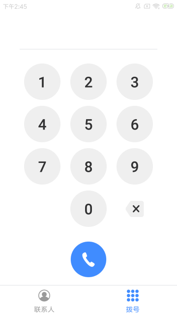

# 远程协作
## 联系人
联系人管理，包含了联系人列表，增加和编辑联系人  

## 拨号
可以直接拨打眼镜绑定的号码   

## 通话
### 主动拨打

### 接听

拨打和接听过程中会出现以下几种断开的情况    
目前接入的是第三方SDK-菊风，异常情况的处理是参考它们的返回值

|名称|含义|
|---|---|
|REASON_NOT_LOGIN|未登录
|REASON_TIMEOUT|超时
|REASON_NOT_FOUND|无此用户
|REASON_NETWORK|网络错误
|REASON_TERM_BY_SELF|自己挂断

### 建立通话
通话建立后，会有出现该画面

支持操作：   
关闭本地摄像，切换前后摄像头     
直接挂断电话   
涂鸦  

### 涂鸦
点击涂鸦，屏幕会出现涂鸦区域  
在App端进行涂鸦操作，眼镜端可以看到手机端标记的内容    
目前支持画一笔，清除后可以再进行涂鸦  

