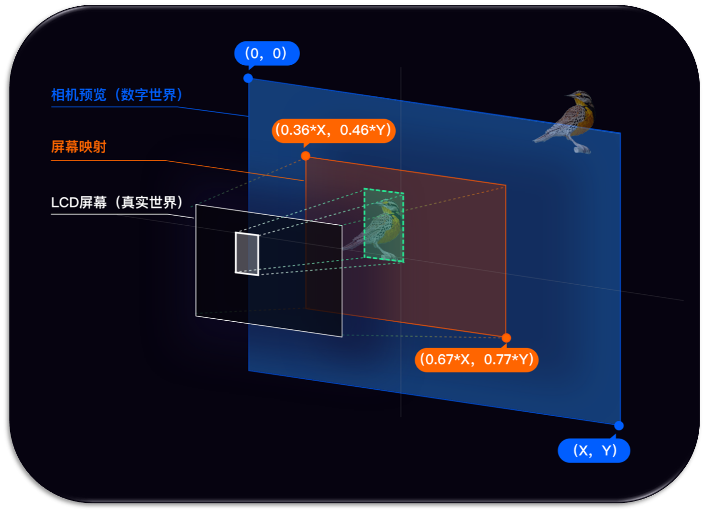

<!-- toc -->

# 简介

`Glass-hardware`基于[UVC](#uvc)以及[USB主机设备](#usbhost)实现，具备UVC所有功能以及Rokid-Glass硬件的按键、触摸、IMU事件、硬件信息（光机版本、SN号等）

# 环境准备

* 安装AndroidStudio
* 新建Android工程

# 快速上手

1. 在项目根目录配置`maven`仓库地址

    ```groovy
        allprojects {
                repositories {
                    maven { url = 'http://maven.rokid.com/repository/maven-public/' }
                }
        }
    ```
    
2. 在`app/build.gradle`文件中添加模块依赖

    ```groovy
    implementation 'com.rokid.alliance.usbcamera:usbcamera:1.1.16'
    ```
    
3. SDK权限依赖
   
    ```groovy
    <uses-permission android:name="android.permission.WRITE_EXTERNAL_STORAGE" />
    <uses-permission android:name="android.permission.READ_EXTERNAL_STORAGE" />
    <uses-permission android:name="android.permission.CAMERA" />
    <uses-permission android:name="android.permission.INTERNET" />
    <uses-permission android:name="android.permission.READ_PHONE_STATE" />
    ```
    
4. 修改`app/build.gradle`中targetSdkVersion<=27
5. 初始化SDK

    ```java
        RKGlassDevice.RKGlassDeviceBuilder
                        .buildRKGlassDevice()
                        .withGlassSensorEvent(new GlassSensorEvent() {
        
                            /**
                             * 距离传感器你
                             * @param status  true可认为是带上眼镜 唤醒光机 false可认为已摘下眼镜 熄灭光机
                             */
                            @Override
                            public void onPSensorUpdate(final boolean status) {
                                RKGlassDevice.getInstance().setBrightness(status ? 100 : 0);//可以根据距离传感器来判断眼镜是否处于佩戴状态，来调整光机的亮度节能
                                lSensorBar.setProgress(status ? 100 : 0);
                                tvPSensor.post(() -> tvPSensor.setText("距离传感器状态: " + status));
                            }
        
                            /**
                             * 前置光线传感器
                             * @param lux 最小值为0
                             */
                            @Override
                            public void onLSensorUpdate(final int lux) {
                                tvLSensor.post(() -> tvLSensor.setText("光线传感器: " + lux));
                            }
    
                            @Override
                            public void OnRotationVectorUpdate(long timestamp, float[] data) {
    
                            }
    
                            @Override
                            public void OnGameRotationVectorUpdate(long timestamp, float[] data) {
    
                            }
    
                            @Override
                            public void OnAcceleroMeterEvent(long timestamp, float[] data) {
    
                            }
    
                            @Override
                            public void OnMagnetFieldEvent(long timestamp, float[] data) {
    
                            }
    
                            @Override
                            public void OnGyroscopEvnet(long timestamp, float[] data) {
    
                            }
                        })
                        .withRKKeyListener(new RKKeyListener() {
        
                            /**
                             * 电源键键事件
                             * @param eventType {@link KeyEventType}
                             */
                            @Override
                            public void onPowerKeyEvent(final int eventType) {
                                tvPower.post(() -> tvPower.setText("电源键事件: " + eventToString(eventType)));
                            }
        
                            /**
                             * 回退键事件
                             * @param eventType {@link KeyEventType}
                             */
                            @Override
                            public void onBackKeyEvent(final int eventType) {
        
                                tvBack.post(() -> tvBack.setText("回退键事件: " + eventToString(eventType)));
                            }
        
                            /**
                             * 触控板事件
                             * @param eventType {@link RKGlassTouchEvent}
                             */
                            @Override
                            public void onTouchKeyEvent(final int eventType) {
        
                                tvTouch.post(() -> tvTouch.setText("TouchBar事件: " + eventToString(eventType)));
                            }
        
                            /**
                             * 触控板向后滑动
                             */
                            @Override
                            public void onTouchSlideBack() {
        
                                tvSlide.post(() -> tvSlide.setText("向后滑动"));
                            }
        
                            /**
                             * 触控板向前滑动
                             */
                            @Override
                            public void onTouchSlideForward() {
        
                                tvSlide.post(() -> tvSlide.setText("向前滑动"));
                            }
                        })
                        .build()
                        .initUsbDevice(this, mPreview, new OnGlassConnectListener() {
        
                            /**
                             * 当用户授权眼镜权限后 将回调
                             * @param usbDevice {@link UsbDevice}
                             * @param glassInfo {@link GlassInfo}
                             */
                            @Override
                            public void onGlassConnected(UsbDevice usbDevice, GlassInfo glassInfo) {
                                tvDeviceInfo.post(() -> tvDeviceInfo.setText("Glass信息：vendorId:" + usbDevice.getVendorId()
                                        + " productId: " + usbDevice.getProductId() + " deviceName: "
                                        + usbDevice.getDeviceName() + " SN: " + glassInfo.getSn()));
        
                                lSensorBar.setProgress(RKGlassDevice.getInstance().getBrightness());
                                lSensorBar.setOnSeekBarChangeListener(new SeekBar.OnSeekBarChangeListener() {
                                    @Override
                                    public void onProgressChanged(SeekBar seekBar, int progress, boolean fromUser) {
                                        // 调整光机亮度 范围0~100
                                        RKGlassDevice.getInstance().setBrightness(progress);
                                    }
        
                                    @Override
                                    public void onStartTrackingTouch(SeekBar seekBar) {
        
                                    }
        
                                    @Override
                                    public void onStopTrackingTouch(SeekBar seekBar) {
        
                                    }
                                });
                            }
        
                            /**
                             * 当眼镜断开连接时
                             */
                            @Override
                            public void onGlassDisconnected() {
                                tvDeviceInfo.post(() -> tvDeviceInfo.setText("Glass断开连接"));
                            }
                        });
    ```

6. 释放SDK

    ```java
    RKGlassDevice.getInstance().removeOnPreviewFrameListener(onPreviewFrameListener);
    RKGlassDevice.getInstance().deInit();
    ```

# 进阶篇

## 如何鉴别UsbDevice为Rokid眼镜

 字段 | 类型 | 值 | 说明
 ---- | ---- | ---- | ---- 
VendorId | int | 1234 | 通过UsbDevice#getVendorId()获取
ProductId | int | 5678 | 通过UsbDevice#getProductId()获取

## 获取眼镜其他信息 <div id="获取眼镜其他信息"></div>
**[获取方式](#sdk_use)**，在`RKGlassDevice#initUsbDevice(...)`回调函数中，我们可以获取到眼镜的基本信息`GlassInfo`，字段说明如下：

字段 | 类型 | 说明
--- | --- | ---
sn  | String | 区分眼镜唯一标识序列号
typeId | String | 设备TypeId
pcba | String | 设备PCBA编码
vSyncStatus | boolean | 设备VSync状态
opticalId | String | 可区分眼镜生产批次，其值目前有三个，分别是"1"、"2"、"3"

**注意：**opticalId区分眼镜批次后主要用于alignment对齐。alignment对齐可以理解为当对现实场景进行标注时，应用在眼镜屏幕的标注点与实际人眼看到的位置不一样，因此需要对屏幕标注的位置进行调整。根据眼镜生产批次的不同（我们认为同一批次的眼镜调整系数是一样的），通过opticalId进行区分。

## 获取摄像头数据

1. 监听camera数据回调
   
    ```java
     RKGlassDevice.getInstance().setOnPreviewFrameListener(bytes -> {//NV21
            //TODO
        });
    ```
2. 取消camera数据回调
   
    ```java
    RKGlassDevice.getInstance().removeOnPreviewFrameListener(AbstractUVCCameraHandler.OnPreViewResultListener: onPreviewFrameListener);
    ```

## Alignment对齐


###  Alignment概念

Camera预览界面通过Glass显示屏幕进入人眼睛的映射过程.

* 在手机上开发如下图：


* 在眼镜上开发如下图：



1. 蓝色代表`相机预览`的画面
2. 绿色代表`相机预览`中物体的坐标
3. 橙色代表`LCD屏幕`在`相机预览`的映射区域,百分比表示真实世界在虚拟世界的比例
4. 白色代表物体映射到`LCD屏幕`的显示区域


### 获取Alignment

以下示例针对矩形框进行Alignment校准，如果是其他形状请参考以下示例进行校准：

```java
Rect rect = new Rect(20, 20, 100, 100);//相机预览Rect位置，比如人脸识别使用Camera数据进行人脸检测后得到的人脸框，这个人脸框绘制到眼镜屏幕上需要进行校准，真实的位置需要根据眼镜硬件的生产批次进行位置调整

//PREVIEW_WIDTH和PREVIEW_HEIGHT为屏幕的分辨率，ROKID二代眼镜分辨率是1280*720，rect为待校准的人脸框，返回校准后的人脸框，这个人脸框就是最终绘制到屏幕的区域
Rect rectAfterAlignment = RokidSystem.getAlignmentRect(PREVIEW_WIDTH, PREVIEW_HEIGHT, rect);
```


# FAQ

# 联系我们

SDK使用问题请直接通过github-issue提问即可。


# 名词解释

* `UVC`:USB Device Class


# 附录

* [UVC](https://github.com/jiangdongguo/AndroidUSBCamera) <div id="uvc"></div>
* [USB主机设备](https://developer.android.com/guide/topics/connectivity/usb/host?hl=zh-cn) <div id="usbhost"></div>

