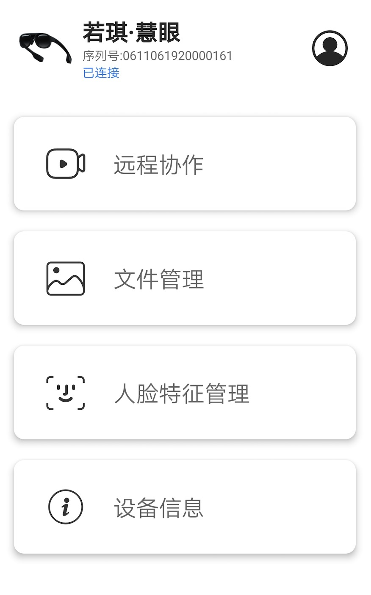
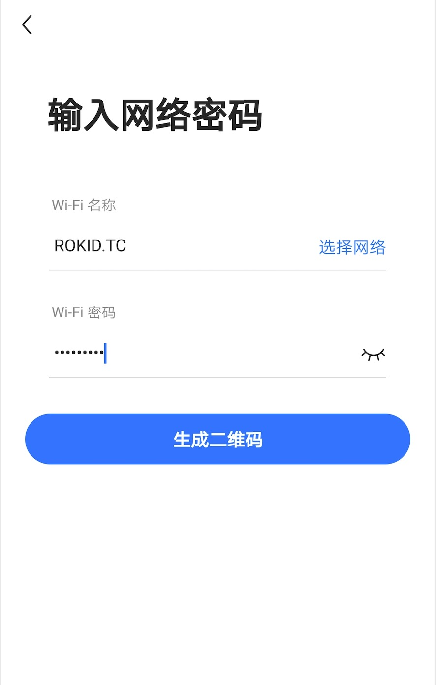

# 眼镜公版APP介绍

## 什么是若琪眼镜公版APP

若琪眼镜公版APP提供了对若琪眼镜进行配网，远程协作，文件管理，人脸特征库管理等的交互能力。

## 主要模块

公版APP主要由以下几个模块构成，分别是：

- [远程协作](remotecooperation.md)
- [账号管理](account.md)
- [人脸特征管理](facemanager.md)
- [文件管理](filemanager.md)
- [个人设置](person.md)
- [设备信息](devicemanager.md)

## 绑定设备

如果未绑定眼镜，只能使用远程协作功能

要绑定设备，首先点击【添加设备】，进入【输入网络密码】界面，输入一个可以正常连接的WIFI 名称和密码：

之后点击【生成二维码】，打开眼镜端的【设置】-【Wi-Fi】-【连接新网络】，进行扫描二维码配网：

