# FAQ

---------


## 1. Frequently asked development questions

### **Q: Why did I fail to use hardware H.264 encoding when developing an app on the glasses?**

A: The system hardware's MediaCodec encoding has restrictions on resolutions of the input stream. The resolution width and the resolution height of the input stream must be multiples of 16 and 2 respectively. Otherwise, the encoding will fail. If hardware H.264 encoding fails or causes a crash, please check whether resolution of the input stream meets the above requirement.

### **Q: Why can’t I set the brightness for automatic exposure compensation when developing an app on the glasses?**

A: Currently, an extended camera exposure mode is provided. With the automatic exposure compensation interface, the app can reference the following interfaces.

```java
    Solution 1: Camera API1
	int aeCompMode; //0 for global exposure and 1 for lower triangle exposure
	Camera.Parameters parameters = mCamera.getParameters();
	parameters.setExposureCompensation(aeCompMode);
	mCamera.setParameters(parameters);

	Solution 2: Camera API2
	int aeCompMode; //0 for global exposure and 1 for lower triangle exposure
	mPreviewBuilder.set(CaptureRequest.CONTROL_AE_EXPOSURE_COMPENSATION, aeCompMode);

```


### **Q: Fail to use GPS&4G**
A: Devices with a serial number starting with 082 support 4G and GPS, and devices starting with 081 do not support 4G and GPS; in addition, please note that when the dock is connected to the computer through the debugging port, 4G and GPS will be disconnected. Please use network adb to debug GPS&4G function.


### **Q: Fail to record video layer**
A: If you use SurfaceView to play video, you cannot record the video screen during screen recording/casting. If you want to record/cast the screen to capture the video layer, you must use TextureView to play the video.

### **Q: Is the glass system 32-bit or 64-bit**
A: Our system is 32-bit.

### **Q: Can't find the BT device**
A: In the Bluetooth function of our system settings, the device type is filtered when searching, and only Bluetooth headset devices are displayed. If you need to pair other Bluetooth devices, you can develop your own Bluetooth search and pairing function.

## 2. How to upgrade operating system of the glasses by OTA update

### Step 1: Check the version information
Settings-->System-->About; If the OS version is too low, then you need to perform a manual OTA update.	 
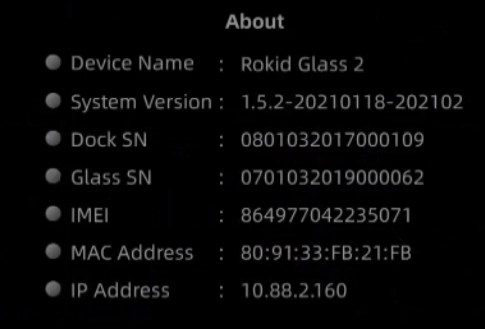

### Step 2: Perform an OTA update by following the steps below.	 
Settings-->Sys Update-->Check for updates	 
## 3. Connecting to the glasses from Windows

### Overview

* Because the built-in MTP device driver of Windows 7 systems cannot automatically adapt to the dock device of the 2nd-generation glasses, you need to manually install a compliant MTP driver, if you want to connect the dock to a Windows 7 system to perform file management.
* Most Windows 8 and 10 systems can automatically install the MTP driver. So, after connecting the dock to such a system, you can find the Glass device in "This PC" once automatic installation of the driver is complete. In case the automatic installation fails, you can manually install the driver by following the steps below.

### How to manually install the MTP driver

1. Connect the dock of the 2nd-generation glasses to the computer via a USB cable, and then right click Computer, and click the device manager (for the Windows 7 system):

    

    ***Note: The screenshot is for the Windows 7 system. In Windows 8 and 10 systems, you need to right click This Computer, select Manage, and click and select System Tools -> Device Manager on the left side of the pop-up window to open the device manager. Then, Device Manager window is popped up on the right side, as shown in the following figure: (the subsequent Steps 2-13 are completely the same)***
    
    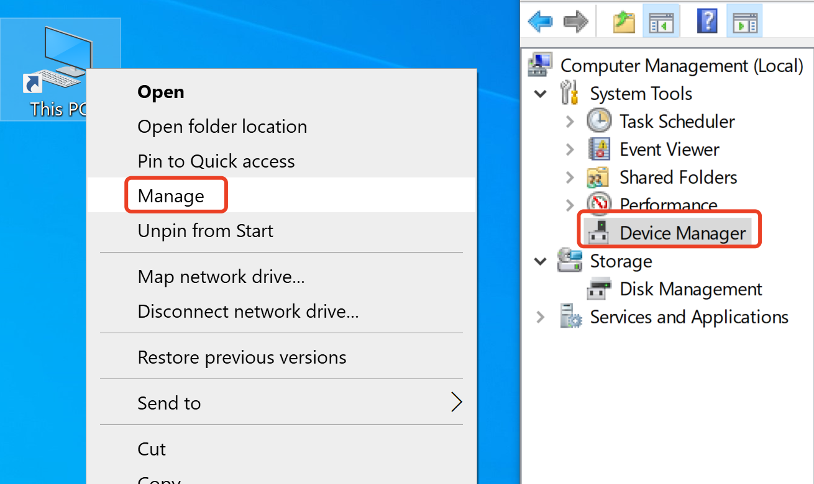

2. Then, you can see in the pop-up window that there is an MTP device in Other Devices column, with a yellow exclamation mark indicating that the glasses device has been connected but not identified successfully:

    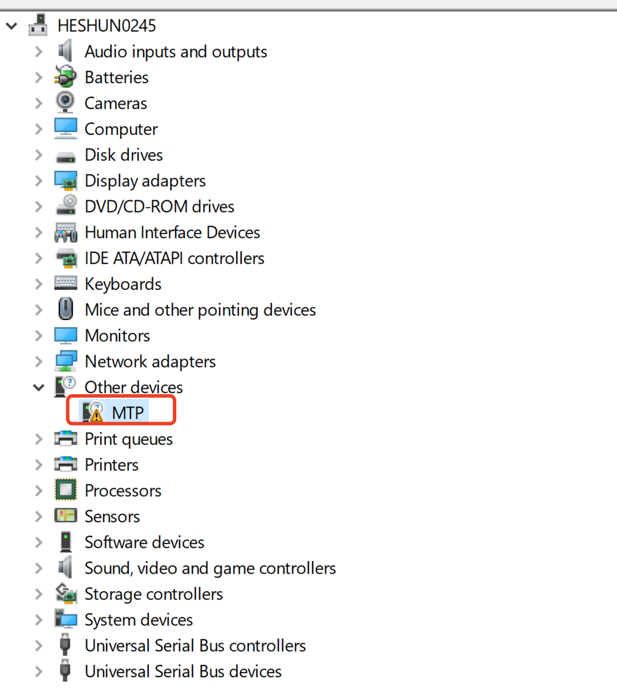

3. Right click on the MTP menu, and select to update the driver software:

    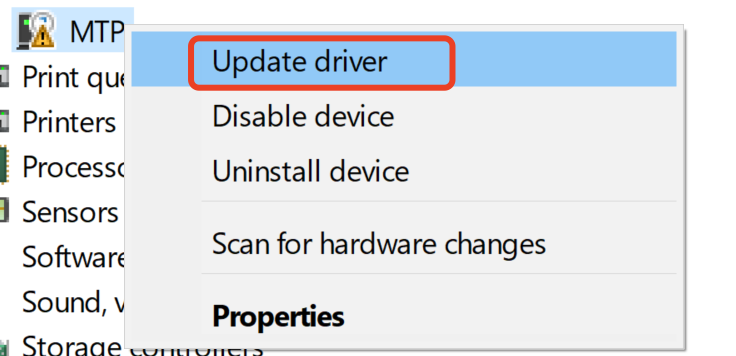

4. In the interface that appears, click to select Browse the computer to find the driver software, as shown in the red box in the following figure:

    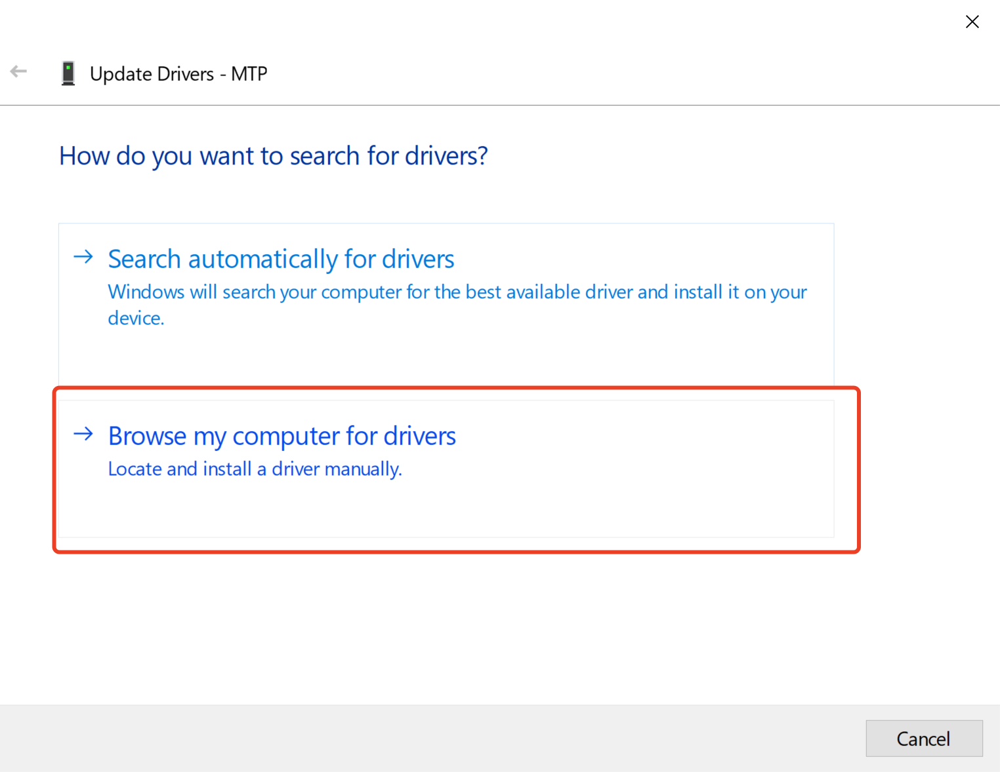

5. In the interface that appears, select Choose from the list of device drivers on the computer, as shown in the red box in the following figure:

    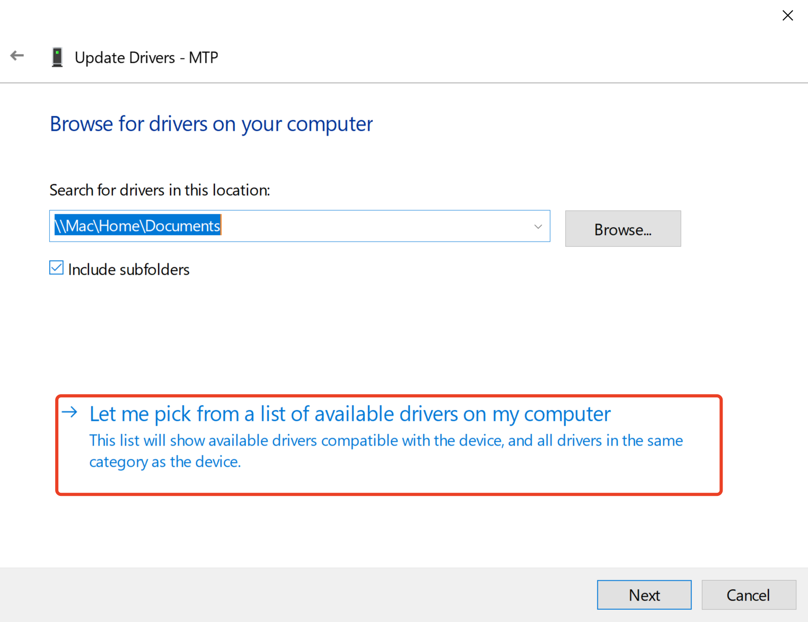

6. Drag the navigation button on the right side, find portable devices, left click and select it, and click Next:

    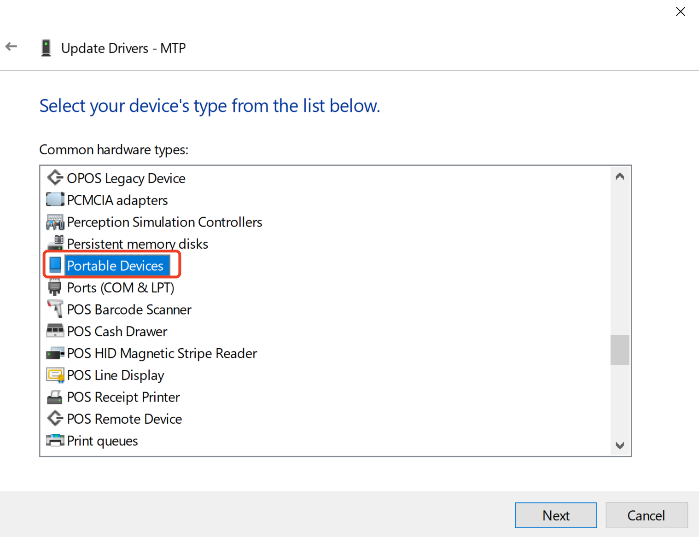
    
7. In Manufacturer column on the left side of the pop-up window, left click and select Standard MTP Device, and then left click and select MTP USB Device in Model column on the right side, and click Next:

    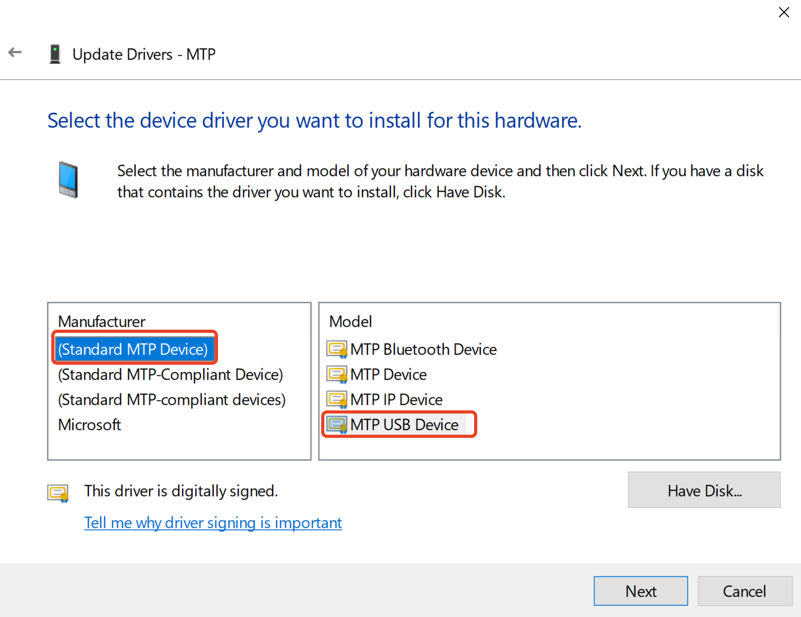
    
8. Then, when a driver compatibility warning appears, click Yes button:

    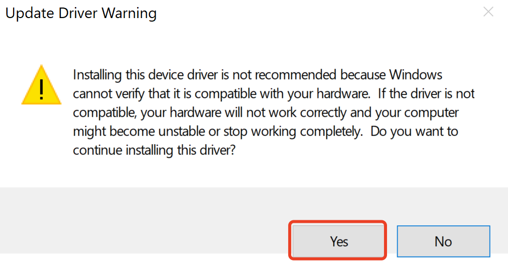

9. Then, an installation progress bar interface pops up, and wait a short while:

    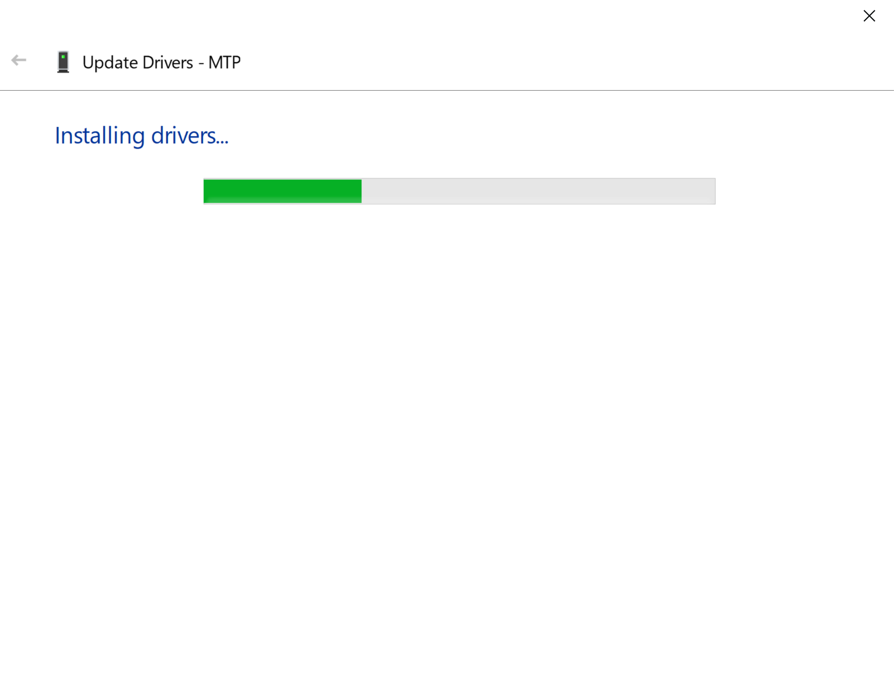
    
10. If the installation is successful, a success interface will appear

    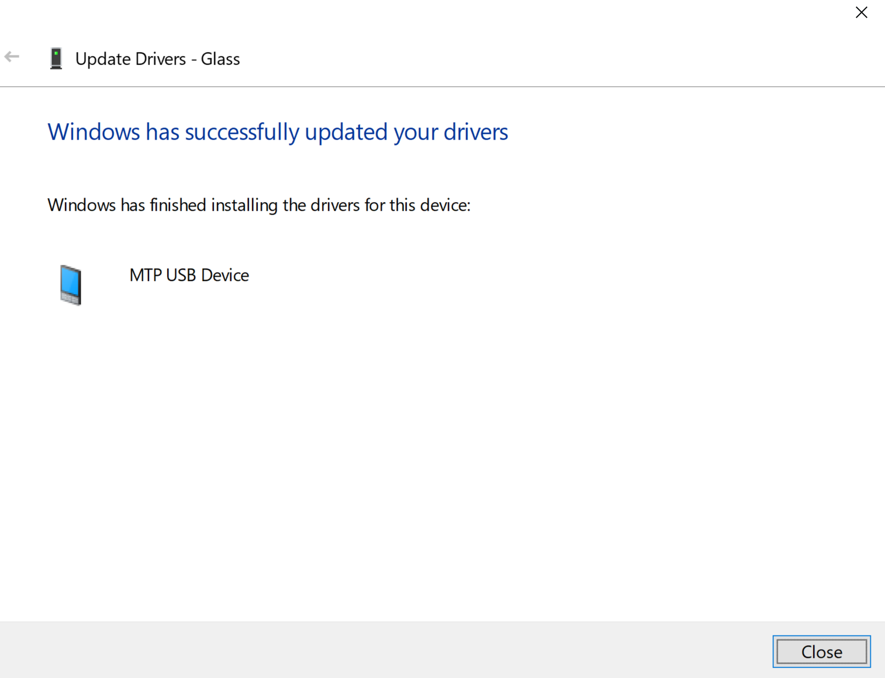
    
11. Then, the exceptional MTP device in Device Manager disappears, while Portable Devices appears, and you can find Glasses under it:

    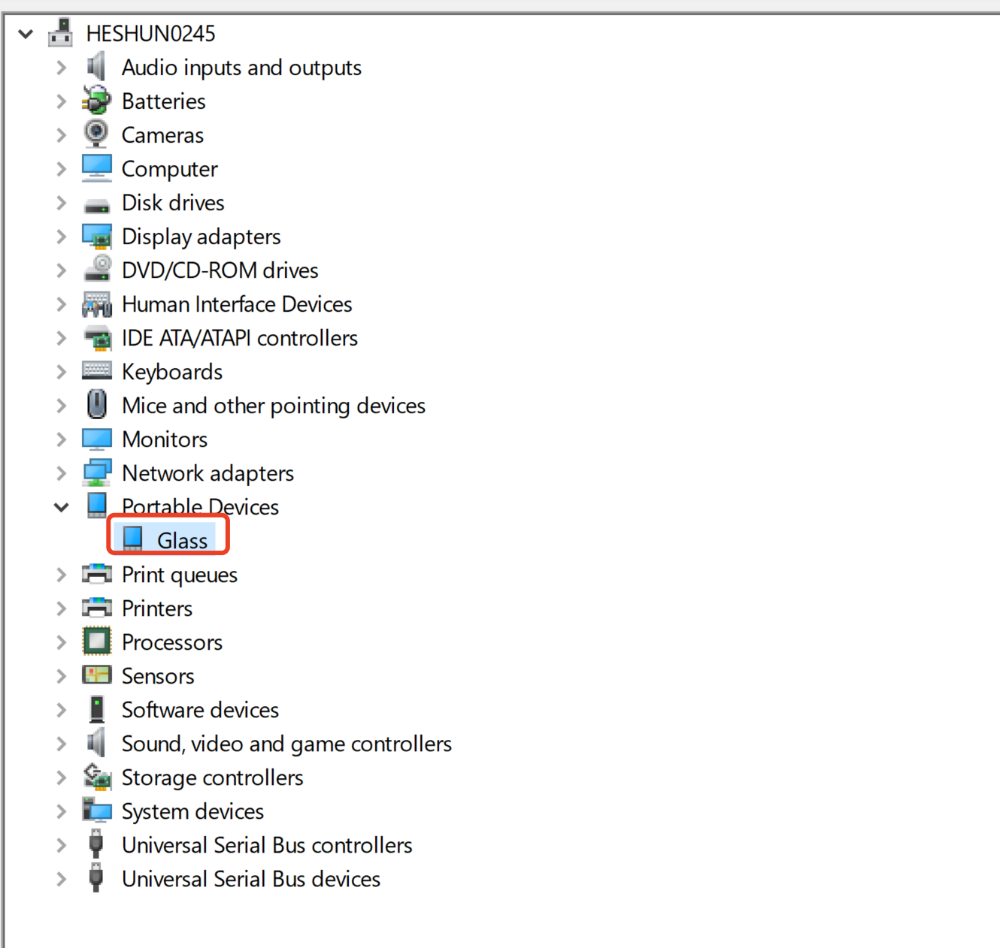
    
12. Close Device Manager, click to enter Computer, and you can find a portable device named Glasses:

    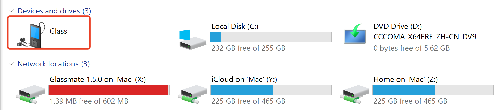
    
13. Double-click Glasses device to enter it to perform operations, such as read from a file and write to a file, as on the normal hard disk:

    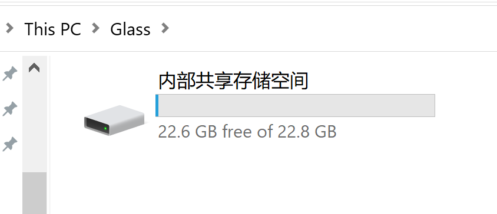
    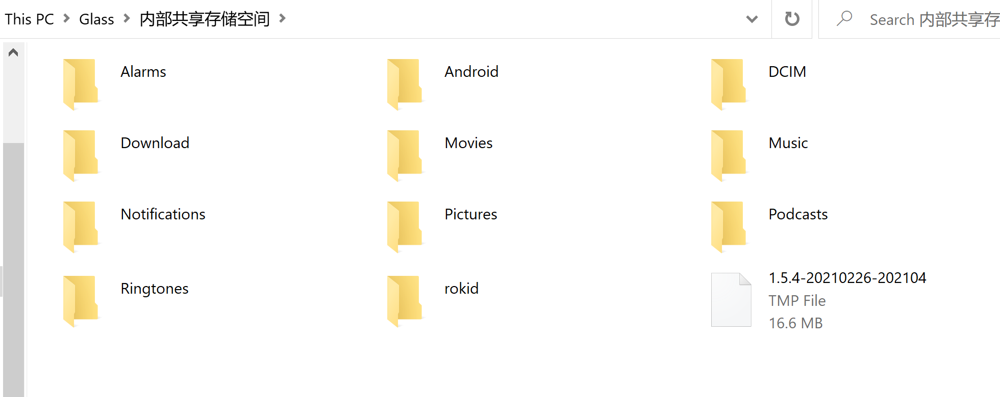
    
14. After you have waited for a period of time at Step 9, the following interface may appear if the installation of the driver has failed, indicating that the built-in driver of the system has an exception, and you need to remove and reconnect the dock and repeat Steps 1-9. If unsuccessful installation persists, we recommend that you use another computer, or contact technical support for assistance.

    


```

