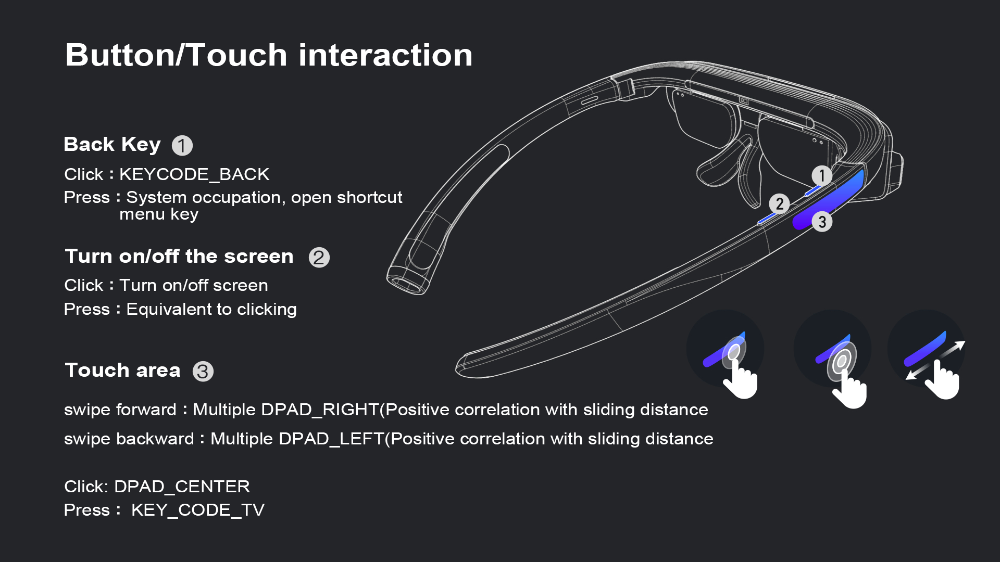

## Key value description

<h3 id="1">1、Glass Key value</h3>



<h3 id="2">2、Dock Key value</h3>

* Dock only one power button, the system is occupied, and the user cannot customize
	* Click: display battery
	* long Press: Turn on or turn off

<h3 id="3">3、示例代码</h3>

```java
@Override
public boolean onKeyDown(int keyCode, KeyEvent event) {
      //Long press is generally triggered by onKeyDown
      switch (keyCode) {
            case KeyEvent.KEYCODE_TV:
                  Log.i(TAG,“with long press”);
                  break;
            ...
            default:
                  break;
      }
      return super.onKeyDown(keyCode, event);
}
    
@Override
public boolean onKeyUp(int keyCode, KeyEvent event) {
      //Sliding forward and backward is usually triggered by onKeyUp
      switch (keyCode) {
            case KeyEvent.KEYCODE_DPAD_DOWN:
		      Log.i(TAG,“Slide forward”);
		      break;
            case KeyEvent.KEYCODE_DPAD_UP:
		      Log.i(TAG,“Slide back”);
		      break;
            ...
            default:
                  break;
      }
      return super.onKeyUp(keyCode, event);
}
```
