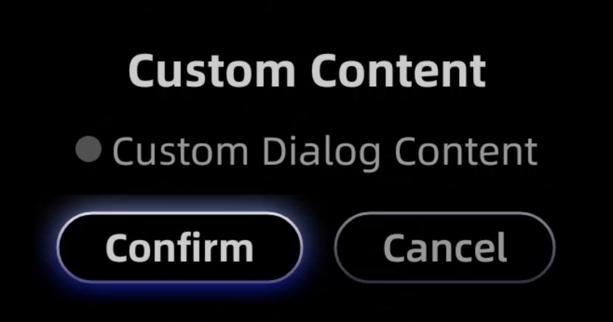
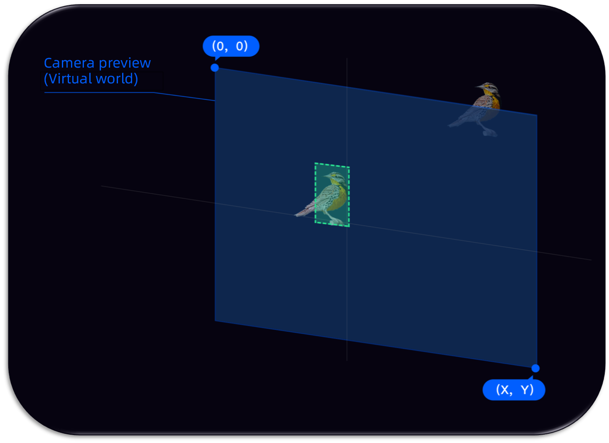
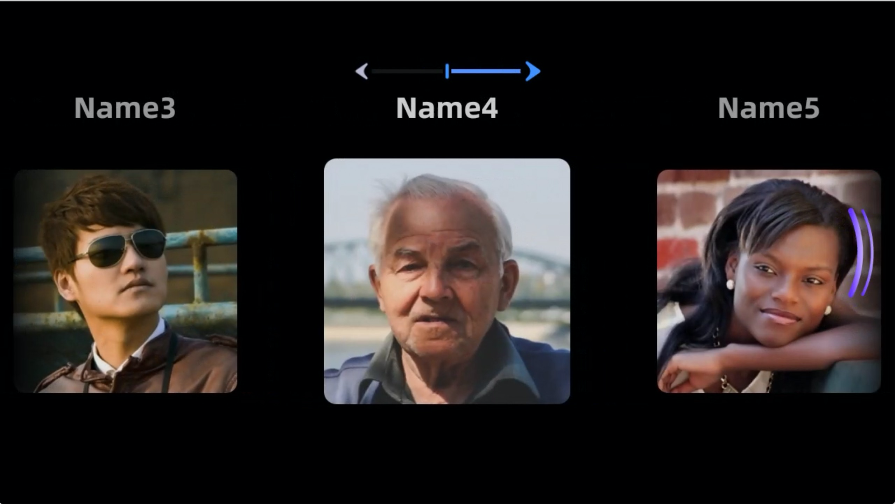

# Glass UI SDK

**Version: 1.6.2**

## 1. Introduction to UI SDK

---


### 1.1 Overview

This SDK provides a set of basic UI libraries for developing applications on Rokid Glass, and currently supports the following items:

**1. GlassButton**  
Custom button of Glass

**2. GlassDialog**  
Provides a series of commonly used dialog boxes

**3. Screen adaptation**   
Screen adaptation scheme, which can keep the UI uniformly and proportionally displayed on Rokid Glass

**4. GlassAlignment**  
Due to the unique screen display characteristics of AR glasses, such as optical see through. In order to guarantee a good experience, when developing recognition applications on glasses,  
we recommended that you do not display the camera preview. Then perform an alignment mapping of the calibration content which will be displayed after recognition. This ensures that the calibration content seen by the human eye is fixed on the real object.

**5. IMU view**  
Provides a control which automatically scrolls a list horizontally according to the head's movement

## 2. Integration procedure

---


Add a dependency called jcenter to build.gradle in the project:

```gradle
allprojects {
    repositories {
        google()
        jcenter()
    }
}
```

### 2.1 Gradle dependencies

In the /app/build.gradle file of the project, add the following dependencies:

```gradle
...
dependencies {
    ...
    implementation 'com.rokid.glass:ui:1.5.6'
}
```

### 2.2 Demo download

[download demo](https://static.rokidcdn.com/sdk/sdk_glass_ui-5e0971f.zip)

## 3. Function list

---


### 3.1 GlassButton

Custom button of Glass

`Focused`:


`Normal`


#### 3.1.1 Usage

```xml
 <com.rokid.glass.ui.button.GlassButton
    android:id="@+id/custom_dialog_btn"
    android:layout_width="wrap_content"
    android:layout_height="wrap_content"
    android:text="Custom Dialog"
    app:layout_constraintLeft_toLeftOf="parent"
    app:layout_constraintRight_toRightOf="parent"
    app:layout_constraintTop_toBottomOf="@id/dialog_btn" />
```

### 3.2 GlassDialog

A series of commonly used dialog boxes are provided, and different types of dialog boxes can be constructed through Builders. Builder provided currently:

#### 3.2.1 CommonDialogBuilder

Generic DialogBuilder



| method| Meaning| Remarks
|----------|----------|----------
| setTitle| Set title| 
| setContent| Set the layout of content| or custom content
| setConfirmText| Set the confirm button text| 
| setCancelText| Set the cancel button text| 
| setContentLayoutId| Set the id of custom content layout| 
| setContentLayoutView| Set the view of custom content layout| or the id of custom content layout
| setConfirmListener| Set Confirm listener| 
| setCancelListener| Set Cancel listener| 

**Sample code**

```java
new GlassDialog.CommonDialogBuilder(this)
        .setTitle("Title")
        .setContent("Content")
        .setConfirmText("Confirm")
        .setCancelText("Cancel")
        .setContentLayoutId(R.layout.layout_custom_dialog_content)
        .setConfirmListener(new GlassDialogListener() {
            @Override
            public void onClick(View view) {

            }
        })
        .setCancelListener(new GlassDialogListener() {
            @Override
            public void onClick(View view) {

            }
        })
        .show();
```

### 3.3 Screen adaptation

Declare the following in `AndroidManifest.xml` of app:

```java
<manifest>
    <application>            
        <meta-data
            android:name="design_width_in_dp"
            android:value="640"/>
        <meta-data
            android:name="design_height_in_dp"
            android:value="360"/>           
     </application>           
</manifest>
```

The parameters are configured according to the size of the design drawing, based on width or height. The default benchmark is width.

#### Simulator preview settings


### 3.4 GlassAlignment

* Concept of alignment:
  
  * The mapping process when camera preview interface enters human eyes through the Glass display screen.

* Develop on the mobile as shown below:


* Develop on the glasses as shown below:


1. Blue represents the image of `camera preview` 
2. Green represents the coordinates of the object in the `camera preview`
3. Orange represents the mapping area of the `LCD screen` in the `camera preview`. The percentage represents the proportion of the real world in the virtual world
4. White represents the object mapped to the display area of the `LCD screen`

#### 3.4.1 getAlignmentRect

Note: Get the area mapped to the LCD screen according to the rect of preview.

```java
public static Rect getAlignmentRect (final int previewWidth, final int previewHeight, final Rect previewRect)
```

| Parameter| Meaning| Default value
|----------|----------|----------
| previewWidth| Width of camera preview| 
| previewHeight| Height of camera preview| 
| previewRect| Camera preview的Rect| 

Sample code: After face recognition, draw a face Rect on the screen

```java
public static final int PREVIEW_WIDTH = 1280;
public static final int PREVIEW_HEIGHT = 720;

// face area of camera preview
Rect previewRect = faceDoCache.faceDo.toRect(getWidth(), getHeight());

//According to the face Rect of preview, map and then get the Rect that is finally drawn on the screen
Rect rect = RokidSystem.getAlignmentRect(PREVIEW_WIDTH, PREVIEW_HEIGHT,previewRect);

...
//foundation
canvas.save();
canvas.translate((rect.left + rect.right) / 2f, (rect.top + rect.bottom) / 2f);
...
canvas.restore();
...
```

#### 3.4.2 getWindowRect

Note: According to the rect of the LCD screen, get the rect of preview area

```java
public static Rect getWindowRect(final int previewWidth, final int previewHeight, final Rect windowRect)
```

| Parameter| Meaning| Default value
|----------|----------|----------
| previewWidth| Width of camera preview| 
| previewHeight| Height of camera preview| 
| windowRect| Rect of LCD screen| 

#### 3.4.3 getProjectionMatrix\_OpticalSeeThrough

Note: Obtain the projection matrix of OpenGLES 3D application in the OpticalSeeThrough scene and horizontal screen state. In result, the calibration content seen by the human eye is aligned with the real world

```java
public static float[] getProjectionMatrix_OpticalSeeThrough()
```

Sample code: For horizontal screen applications, get the projection matrix of the OpenGLES MVP matrix

```java
float projectionMatrix[] = RokidSystem.getProjectionMatrix_OpticalSeeThrough();
...

```

### 3.5 IMU view

* IMU view control: Provide a list control that can auto scroll horizontally by turning the header left and right. Developers can quickly use the head control and quick swipe function.
* If the user opens the header control and quick swipe function in the system settings, IMU view control will take effect.

#### 3.5.1 Sample usage


#### 3.5.2 Usage

```java
Initialize in application:
IMUSdk.init(this);
Method:
getLifecycle().addObserver(mImuView);//Lifecycle binding
mImuView.setSlow();//The default setting is fast sliding mode, and can be set to slow sliding mode
mImuView.setAdapter(mAdapter);
```

```xml
<com.rokid.glass.imusdk.core.IMUView
        android:id="@+id/ui_recycler_view"
        imulabmarginleft="10"
        imulabmargintop="10"
        imutouchstyle="true"
        android:layout_width="match_parent"
        android:layout_height="match_parent"
        app:imuscale="1.1"
        app:imutouchstyle="true" />

```

| Property configuration| Meaning
|----------|----------
| imuscale| Configure the zoom ratio of the selected item
| imupadding| Configure the space filled in the item to reserve zoom space
| imuspeed| Configure the sliding speed of the uniform sliding mode
| imuguide| Configure whether to display the top navigation bar or not
| imuunable| The default setting is false, setting it to true will block the header control function of imu
| imutitlewidth| Configure the width of the title in default display template
| imulabmarginleft| Configure the position of upper left corner to prompt the distance between the lab and the left boundary
| imulabmargintop| Configure the position of upper left corner to prompt the distance between the lab and the upper boundary
| imutouchstyle| Provide two sliding modes true: simulate touch sliding mode false: uniform sliding mode
| imutouchinterval| Configure the sliding speed of the simulated touch sliding mode

```xml
<declare-styleable name="imuview">
    <attr name="imuscale" format="float"/>
    <attr name="imupadding" format="dimension" />
    <attr name="imuspeed" format="integer" />
    <attr name="imuguide" format="boolean" />
    <attr name="imuunable" format="boolean" />
    <attr name="imutitlewidth" format="dimension" />
    <attr name="imulabmarginleft" format="dimension" />
    <attr name="imulabmargintop" format="dimension" />
    <attr name="imutouchstyle" format="boolean" />
    <attr name="imutouchinterval" format="dimension" />
</declare-styleable>
```

#### 3.5.3 Sliding mode selection

* Configuration method: Configure through imutouchstyle attribute.
* Uniform sliding mode: The list slides at a constant speed, and each item will not have a pause effect. It is mostly used for fast scrolling of content, such as gallery.
* Simulated touch sliding mode: Simulate the effect of manual touch sliding. After each item, there will be a pause effect, which is easy for users to see. It is the default sliding mode.

#### 3.5.4 Customing related functions of head control

* You can register the type of rotation vector sensor of SensorManager.getDefaultSensor(Sensor.TYPE\_GAME\_ROTATION\_VECTOR), and obtain the real-time orientation in the callback of onSensorChanged(SensorEvent event). According to the difference of each callback, judge the current header control state and do corresponding processing.
* Android official website address: https://developer.android.google.cn/reference/kotlin/android/hardware/SensorManager?hl=en

