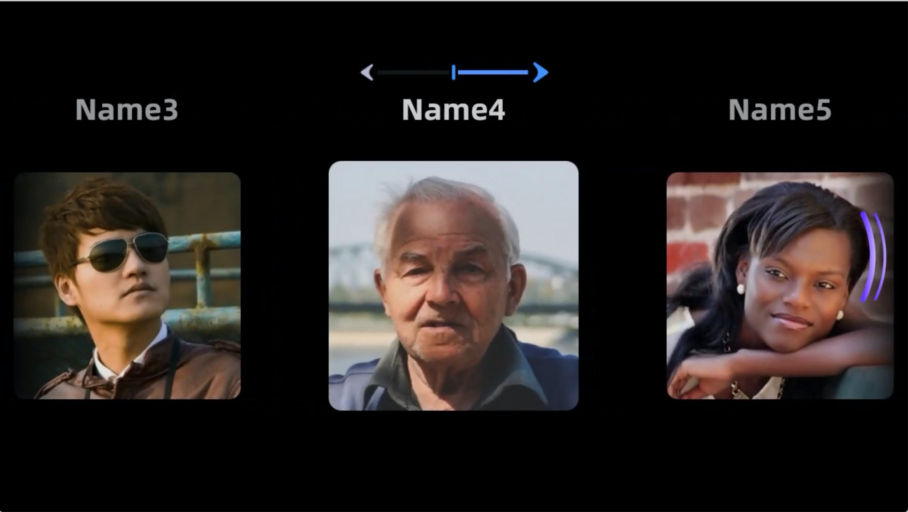

# Glass UI SDK
**Version: 1.6.2**

## 1、UI SDK Introduction
---
### 1.1 Overview
Provides a set of basic UI libraries for developing applications on Rokid Glass, and currently supports the following:

**1. GlassButton**   
Glass Customized Button

**2. GlassDialog**   
Provides a series of commonly used dialog boxes

**3. Screen adaptation**
Screen adaptation scheme, which can keep the UI uniformly and proportionally displayed on Rokid Glass

**4. GlassAlignment**   
Due to the unique screen display characteristics of AR glasses (Optical see through), when developing "recognition applications" on glasses,
To ensure a good experience, it is recommended not to display the camera preview, and then perform an alignment mapping of the calibration content to be displayed after recognition to ensure that the calibration content seen by the human eye is fixed on the real object.

**5. IMU View**   
Provides a list control that can be automatically scrolled horizontally through the head control

## 2、Integration instructions
---
Add jcenter dependency in the project's build.gradle:
``` gradle
allprojects {
    repositories {
        google()
        jcenter()
    }
}
```
### 2.1 Gradle dependency
In the project's /app/build.gradle file, add the following dependencies:
``` gradle
...
dependencies {
    ...
    implementation 'com.rokid.glass:ui:1.5.6'
}
```

### 2.2 Demo download
[Glass UI Demo](https://github.com/rokid/glass-ui)

## 3、function list
---

### 3.1 GlassButton
Glass Customized Button

`Focused`:  


`Normal`


#### 3.1.1 usage
``` xml
 <com.rokid.glass.ui.button.GlassButton
    android:id="@+id/custom_dialog_btn"
    android:layout_width="wrap_content"
    android:layout_height="wrap_content"
    android:text="Custom Dialog"
    app:layout_constraintLeft_toLeftOf="parent"
    app:layout_constraintRight_toRightOf="parent"
    app:layout_constraintTop_toBottomOf="@id/dialog_btn" />
```
### 3.2 GlassDialog
A series of commonly used dialog boxes are provided, and different types of dialog boxes can be constructed through different Builders.
Currently provided Builder:

#### 3.2.1 CommonDialogBuilder
Generic DialogBuilder


|method| meaning|Remarks
|---|---|---|
|setTitle|Set title||
|setContent|Set Content|Choose one with custom content layout|
|setConfirmText|Set the OK button text||
|setCancelText|Set the cancel button text||
|setContentLayoutId|Set content custom layout id||
|setContentLayoutView|Set content custom layout View|And setContentLayoutId choose one|
|setConfirmListener|Set Confirm monitor||
|setCancelListener|Set up Cancel listener||

Sample Code

``` java
new GlassDialog.CommonDialogBuilder(this)
        .setTitle("Title")
        .setContent("Content")
        .setConfirmText("Confirm")
        .setCancelText("Cancel")
        .setContentLayoutId(R.layout.layout_custom_dialog_content)
        .setConfirmListener(new GlassDialogListener() {
            @Override
            public void onClick(View view) {

            }
        })
        .setCancelListener(new GlassDialogListener() {
            @Override
            public void onClick(View view) {

            }
        })
        .show();
```
### 3.3 Screen adaptation
In the app’s `AndroidManifest.xml` statement:
``` java
<manifest>
    <application>            
        <meta-data
            android:name="design_width_in_dp"
            android:value="640"/>
        <meta-data
            android:name="design_height_in_dp"
            android:value="360"/>           
     </application>           
</manifest>
```
Here are based on the size of the design drawing, based on width or height, and the default is width.
#### Simulator Preview settings


### 3.4 GlassAlignment
* Alignment concept:
    * Mapping process in witch the Camera preview interface enters the human eye  through the Glass display screen.

* Develop on the phone as shown below:


* The development on the glasses is as follows:


1. Blue represents the image of `camera preview`
2. Green represents the coordinates of the object in the camera preview
3. Orange represents the mapping area of the LCD screen in the camera preview, and the percentage represents the ratio of the real world to the virtual world
4. White represents the object mapped to the display area of the `LCD screen`

#### 3.4.1 getAlignmentRect
Description: Obtain the area mapped to the LCD screen according to the preview rect
```java
public static Rect getAlignmentRect(final int previewWidth, final int previewHeight, final Rect previewRect)
```
|parameter|meaning|default value
|---|---|---|
|previewWidth|Camera preview width||
|previewHeight|Camera preview height||
|previewRect|Camera preview Rect||

ample code: After face recognition, draw a face Rect on the screen
``` java
public static final int PREVIEW_WIDTH = 1280;
public static final int PREVIEW_HEIGHT = 720;

//Face area of camera preview
Rect previewRect = faceDoCache.faceDo.toRect(getWidth(), getHeight());

//According to the face Rect of preview, after mapping, get the Rect that is finally drawn on the screen
Rect rect = RokidSystem.getAlignmentRect(PREVIEW_WIDTH, PREVIEW_HEIGHT,previewRect);

...

canvas.save();
canvas.translate((rect.left + rect.right) / 2f, (rect.top + rect.bottom) / 2f);
...
canvas.restore();
...
```
#### 3.4.2 getWindowRect
Description: According to the rect of the LCD screen, get the preview area rect
``` java
public static Rect getWindowRect(final int previewWidth, final int previewHeight, final Rect windowRect)
```
|parameter|meaning|default value
|---|---|---|
|previewWidth|Camera preview width||
|previewHeight|Camera preview height||
|windowRect|Rect on LCD screen||

#### 3.4.3 getProjectionMatrix_OpticalSeeThrough
Description: Obtain the projection matrix (horizontal screen state) of the OpenGLES 3D application in the Optical See Through scene, so that the calibration content seen by the human eye is aligned with the real world

``` java
public static float[] getProjectionMatrix_OpticalSeeThrough()
```

Sample code: For horizontal screen applications, get the projection matrix of the OpenGLES MVP matrix

```java
float projectionMatrix[] = RokidSystem.getProjectionMatrix_OpticalSeeThrough();
...

```

### 3.5 IMU View

* IMU View ：Provides a list control that can control horizontal automatic scrolling by turning the head left and right, helping developers to quickly use the "head-controlled swipe" function.

* When the user opens the "Head Control Swipe" in the system settings, your IMU View control will take effect.

#### 3.5.1 Usage example



#### 3.5.2 Instructions


```java
nitialize in Application:
IMUSdk.init(this);
Specific use:
getLifecycle().addObserver(mImuView);//Life cycle binding
mImuView.setSlow();//The default is fast sliding mode, set here can be set to slow sliding mode
mImuView.setAdapter(mAdapter);
```

``` xml
<com.rokid.glass.imusdk.core.IMUView
        android:id="@+id/ui_recycler_view"
        imulabmarginleft="10"
        imulabmargintop="10"
        imutouchstyle="true"
        android:layout_width="match_parent"
        android:layout_height="match_parent"
        app:imuscale="1.1"
        app:imutouchstyle="true" />

```

|Property configuration|meaning|
|---|---|
|imuscale|Configure the zoom ratio of the selected item|
|imupadding|Configure the space filled in the item to reserve zoom space|
|imuspeed|Configure the sliding speed of the uniform sliding mode|
|imuguide|he top navigation bar|
|imuunable|The default is false, set to true will block the imu head control function|
|imutitlewidth|Configure the width of the default display template title|
|imulabmarginleft|Configure the upper left corner position to prompt the distance between the lab and the left boundary|
|imulabmargintop|Configure the upper left corner position to prompt the distance between the lab and the upper boundary|
|imutouchstyle|Provides two sliding modes true: simulated touch sliding mode false: uniform sliding mode|
|imutouchinterval|Configure the sliding speed of the simulated touch sliding mode|

```xml
<declare-styleable name="imuview">
    <attr name="imuscale" format="float"/>
    <attr name="imupadding" format="dimension" />
    <attr name="imuspeed" format="integer" />
    <attr name="imuguide" format="boolean" />
    <attr name="imuunable" format="boolean" />
    <attr name="imutitlewidth" format="dimension" />
    <attr name="imulabmarginleft" format="dimension" />
    <attr name="imulabmargintop" format="dimension" />
    <attr name="imutouchstyle" format="boolean" />
    <attr name="imutouchinterval" format="dimension" />
</declare-styleable>
```

#### 3.5.3 Swipe mode selection

* Configuration method: Configure via imutouchstyle attribute.

* Uniform sliding mode: The list slides at a constant speed, and each item will not have a pause effect. It is mostly used for faster scrolling of content, similar to a gallery.

* Simulated touch sliding mode: Simulates the effect of manual touch sliding. After each item, there will be a pause effect, which is easy for users to see. It is the default sliding mode.

#### 3.5.4 Customized head control related functions

* You can register the rotation vector sensor type of SensorManager.getDefaultSensor(Sensor.TYPE_GAME_ROTATION_VECTOR), get the real-time orientation information in the onSensorChanged(SensorEvent event) callback, and judge the current head control status according to the difference of each callback content and do the corresponding processing

* Android official website address
https://developer.android.google.cn/reference/kotlin/android/hardware/SensorManager?hl=en