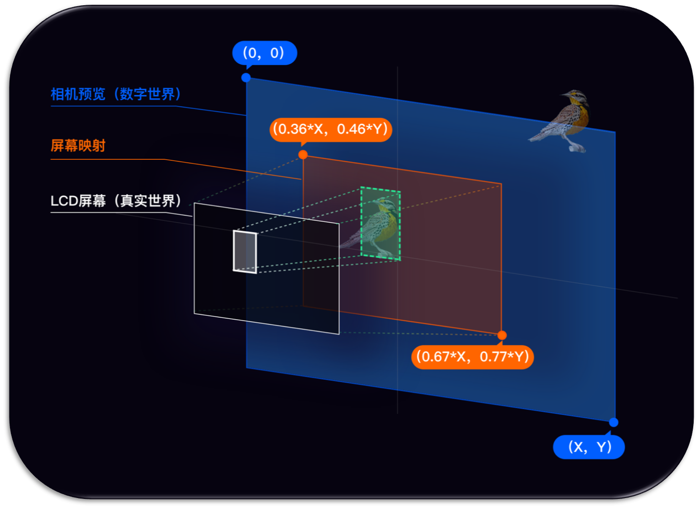

<!-- toc -->
# A brief introduction

`Glass-hardware` is implemented based on [UVC](#uvc) and [USB host device](#usbhost). It has all the UVC functions, plus key events, touchpad events, IMU events, and hardware information of Rokid Glass hardware.

# Prepare the development environment

* Install AndroidStudio
* Create an Android project

# Quick start guide

1. Configure the `maven` warehouse address in the root directory of the project.
   
    ```groovy
       allprojects {
               repositories {
                   maven { url = 'http://maven.rokid.com/repository/maven-public/' }
               }
       }
    ```

2. Add module dependencies in the file `app/build.gradle`.
   
    ```groovy
    implementation 'com.rokid.alliance.usbcamera:usbcamera:1.1.16'
    ```

3. Add the SDK permission dependencies.
   
    ```groovy
    <uses-permission android:name="android.permission.WRITE_EXTERNAL_STORAGE" />
    <uses-permission android:name="android.permission.READ_EXTERNAL_STORAGE" />
    <uses-permission android:name="android.permission.CAMERA" />
    <uses-permission android:name="android.permission.INTERNET" />
    <uses-permission  android:name="android.permission.READ_PHONE_STATE" />
    ```

4. Modify value of targetSdkVersion in `app/build.gradle` so that it is less than 27.

5. Initialize SDK.
   
    ```java
    						RKGlassDevice.RKGlassDeviceBuilder
                        .buildRKGlassDevice()
                        .withGlassSensorEvent(new GlassSensorEvent() {
       
                            /**
                            * Distance sensor
                            * @param status  "true" indicates that the glass is worn and the optics is wakened up, and "false" indicates that the glass is taken off and the optics is off.
                            */
                            @Override
                            public void onPSensorUpdate(final boolean status) {
                                RKGlassDevice.getInstance().setBrightness(status ? 100 : 0);//Determine whether the glass is worn and adjust the brightness of the optics for energy saving based on the distance sensor.
                                lSensorBar.setProgress(status ? 100 : 0);
                                tvPSensor.post(() -> tvPSensor.setText("distance sensor status: " + status));
                            }
       
                            /**
                            * Front light sensor
                            * @param lux minimum value 0
                            */
                            @Override
                            public void onLSensorUpdate(final int lux) {
                                tvLSensor.post(() -> tvLSensor.setText("light sensor: " + lux));
                            }
    
                            @Override
                           public void OnRotationVectorUpdate(long timestamp, float[] data) {
    
                            }
    
                            @Override
                            public void OnGameRotationVectorUpdate(long timestamp, float[] data) {
    
                            }
    
                           @Override
                            public void OnAcceleroMeterEvent(long timestamp, float[] data) {
    
                            }
    
                            @Override
                            public void OnMagnetFieldEvent(long timestamp, float[] data) {
   
                            }
    
                           @Override
                            public void OnGyroscopEvnet(long timestamp, float[] data) {
    
                            }
                        })
                        .withRKKeyListener(new RKKeyListener() {
        
                           /**
                             * event of the Power key
                             * @param eventType {@link KeyEventType}
                            */
                            @Override
                            public void onPowerKeyEvent(final int eventType) {
                                tvPower.post(() -> tvPower.setText("Power Key Press: " + eventToString(eventType)));
                            }
        
                           /**
                             * Event of the Back key
                             * @param eventType {@link KeyEventType}
                            */
                            @Override
                            public void onBackKeyEvent(final int eventType) {
        
                                tvBack.post(() -> tvBack.setText("Back Key Press: " + eventToString(eventType)));
                            }
       
                            /**
                             * Event of the touchpad
                             * @param eventType {@link RKGlassTouchEvent}
                             */
                            @Override
                           public void onTouchKeyEvent(final int eventType) {
        
                                tvTouch.post(() -> tvTouch.setText("TouchBar Press: " + eventToString(eventType)));
                            }
        
                            /**
                             * touchpad sliding backward
                             */
                            @Override
                            public void onTouchSlideBack() {
        
                               tvSlide.post(() -> tvSlide.setText("touchpad sliding backward"));
                            }
        
                            /**
                             * touchpad sliding forward
                             */
                            @Override
                            public void onTouchSlideForward() {
       
                                tvSlide.post(() -> tvSlide.setText("touchpad sliding forward"));
                            }
                       })
                        .build()
                       .initUsbDevice(this, mPreview, new OnGlassConnectListener() {
        
                             /**
                            Call back after the user authorizes the glass permissions
                            * @param usbDevice {@link UsbDevice}
                            * @param glassInfo {@link GlassInfo}
                            */
                           @Override
                            public void onGlassConnected(UsbDevice usbDevice, GlassInfo glassInfo) {
                                tvDeviceInfo.post(() -> tvDeviceInfo.setText("Glass Info：vendorId:" + usbDevice.getVendorId()
                                        + " productId: " + usbDevice.getProductId() + " deviceName: "
                                        + usbDevice.getDeviceName() + " SN: " + glassInfo.getSn()));
        
                                lSensorBar.setProgress(RKGlassDevice.getInstance().getBrightness());
                                lSensorBar.setOnSeekBarChangeListener(new SeekBar.OnSeekBarChangeListener() {
                                    @Override
                                   public void onProgressChanged(SeekBar seekBar, int progress, boolean fromUser) {
                                       // brightness adjustment range of optics 0~100
                                       RKGlassDevice.getInstance().setBrightness(progress);
                                   }
       
                                   @Override
                                   public void onStartTrackingTouch(SeekBar seekBar) {
       
                                   }
       
                                   @Override
                                   public void onStopTrackingTouch(SeekBar seekBar) {
       
                                   }
                               });
                           }
       
                           /**
                           * When the glass is disconnected
                           */
                           @Override
                           public void onGlassDisconnected() {
                               tvDeviceInfo.post(() -> tvDeviceInfo.setText("Glass断开连接"));
                           }
                       });   
   ```
   
6. Release the SDK.
   
    ```java
    RKGlassDevice.getInstance().removeOnPreviewFrameListener(onPreviewFrameListener);
    RKGlassDevice.getInstance().deInit();
    ```

# Advanced topics

## How to identify a USB device as Rokid Glass

| Property| Type| Value| Description
|----------|----------|----------|----------
| VendorId| int| 1234| Obtained through UsbDevice#getVendorId()
| ProductId| int| 5678| Obtained through UsbDevice#getProductId()

## Obtaining other information on the glasses<div id="Obtaining other information on the glasses"></div>

**[Obtaining method](#sdk_use)**: In the `RKGlassDevice#initUsbDevice(...)` callback function, we can obtain the basic information of the glass `GlassInfo`. Descriptions of the fields are as follows:

| Property| Type| Description
|----------|----------|----------
| sn| String| Unique identification SN of glass
| typeId| String| Device TypeId
| pcba| String| Device PCBA code
| vSyncStatus| boolean| Device VSync status
| opticalId| String| It differentiates the production batches of glasses. The values are "1", "2", and "3".

**Note:** opticalId is used to differentiate the production batches of glasses during alignment. When labeling the real scene, the labeling point on the glass screen is different from the position seen by human eyes, and therefore, the alignment function is required to adjust the labeling point on the screen. The production batches of glasses are differentiated through "opticalId". We think that glasses of the same batch has the same adjustment coefficient.

## Obtaining camera's Data

1. Monitor camera data callback
   
    ```java
    RKGlassDevice.getInstance().setOnPreviewFrameListener(bytes -> {//NV21
           //TODO
       });
    ```

2. Cancel camera data callback
   
    ```java
    RKGlassDevice.getInstance().removeOnPreviewFrameListener(AbstractUVCCameraHandler.OnPreViewResultListener: onPreviewFrameListener);
    ```

## Alignment

### Concept of alignment

The mapping process when camera preview interface enters human eyes through the Glass display screen.

* Develop on the mobile as shown below:


* Develop on the glasses as shown below:



1. Blue represents the image of `camera preview`
2. Green represents the coordinates of the object in the `camera preview`
3. Orange represents the mapping area of the `LCD screen` in the `camera preview`. The percentage represents the proportion of the real world in the virtual world
4. White represents the object mapped to the display area of the `LCD screen`

### Obtaining alignment

The following example shows alignment of the rectangular frame. For other shapes, perform alignment by referring to this example.

```java
Rect rect = new Rect(20, 20, 100, 100);//Camera preview Rect position, for example, face frame obtained after face detection using camera data of the face recognition function. The face frame drawn on the glass screen needs to be calibrated to the real position based on the production batch of the glass hardware.

//PREVIEW_WIDTH and PREVIEW_HEIGHT indicate the screen resolution. Rokid glass of 2nd generation has the resolution of 1280*720. "rect" is the face frame to be calibrated, and the face frame returned after calibration is the region finally drawn on the screen.
Rect rectAfterAlignment = RokidSystem.getAlignmentRect(PREVIEW_WIDTH, PREVIEW_HEIGHT, rect);
```

# FAQ

# Contact us

If you have any questions on using the SDK, please submit your questions by creating issues on Github.

# Glossary

* `UVC`: USB Device Class

# Appendices

* [UVC](https://github.com/jiangdongguo/AndroidUSBCamera) <div id="uvc"></div>
* [USB host device](https://developer.android.com/guide/topics/connectivity/usb/host?hl=zh-cn) <div id="usbhost"></div>