# FAQ

---------

## 一、常见开发问题

* **Q: 开发眼镜上应用时，使用硬件h264编码失败？**
	A: 系统硬件mediacodec编码有size的限制，要求输入流的width必须为16的倍数，hight必须为2的倍数，否则编码将报错。如遇到硬件h264编码失败或崩溃，请检查输入流的size是否满足要求。


* **Q: 开发眼镜上应用时，为什么无法设置自动曝光补偿的亮度？**
	A: 当前提供了扩展的相机曝光模式，借用自动曝光补偿接口，应用可参考以下接口：
		
	```java
	方案一：Camera API1
	int aeCompMode; //0 全局曝光，1 下三角曝光
	Camera.Parameters parameters = mCamera.getParameters();
	parameters.setExposureCompensation(aeCompMode);
	mCamera.setParameters(parameters);

	方案二：Camera API2
	int aeCompMode; //0 全局曝光，1 下三角曝光
	mPreviewBuilder.set(CaptureRequest.CONTROL_AE_EXPOSURE_COMPENSATION, aeCompMode);
	```


* **Q: 应用获取眼镜传感器获取问题**
	A: 由于系统硬件限制，默认支持 sensor list 如下，其中并不支持获取 raw data.

	| sensor type       |  status    |
	| ----------------------------------- | ---- |
	| android.sensor.accelerometer 				| Fail |
	| android.sensor.gyroscope            | Fail |
	| android.sensor.magnetic_field       | Fail |
	| android.sensor.game_rotation_vector | OK |
	| android.sensor.rotation_vector      | OK |
	| android.sensor.light                | OK |
	| android.sensor.proximity            | OK |

	考虑到某些应用场景需要获取 raw data，我们提供刷机工具更新眼镜固件，以满足使用场景。更新后可以支持获取 raw data，但此时没有四元数数据。刷机工具可咨询工程师获取。


## 二、眼镜系统版本OTA升级方法:

### Step 1: 信息查询
设置-->本机信息-->版本号、SN号，若版本号较低，则需要手动OTA升级	 


### Step 2: OTA升级步骤	 
设置-->系统升级-->检查更新	 
备注：	 
1. 如未检测到新版本，需找相关人员确认在SN是否在升级列表中；	 
2. 需保证充电状态或电量在 50%以上!	 
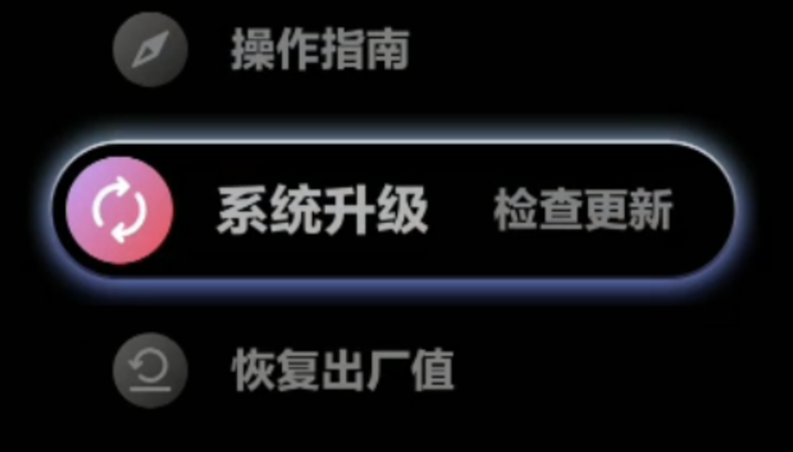

检测到新版本	 


点击“更新”开始下载	 
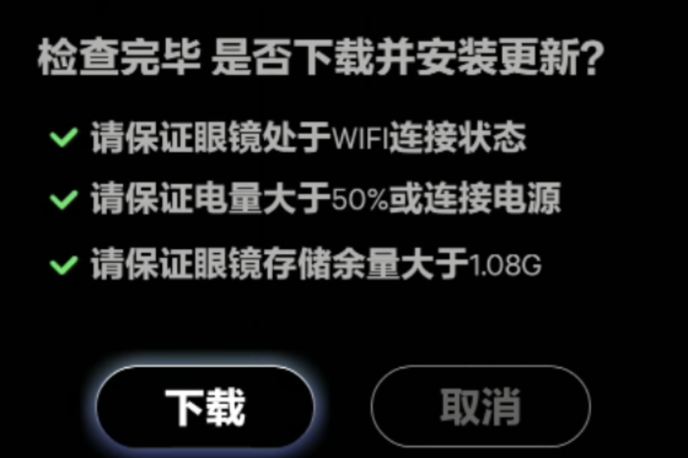

升级成功，重启后生效。 	 原来额外安装在眼镜端的应用，如物体识别、绘本识别不受影响。	 
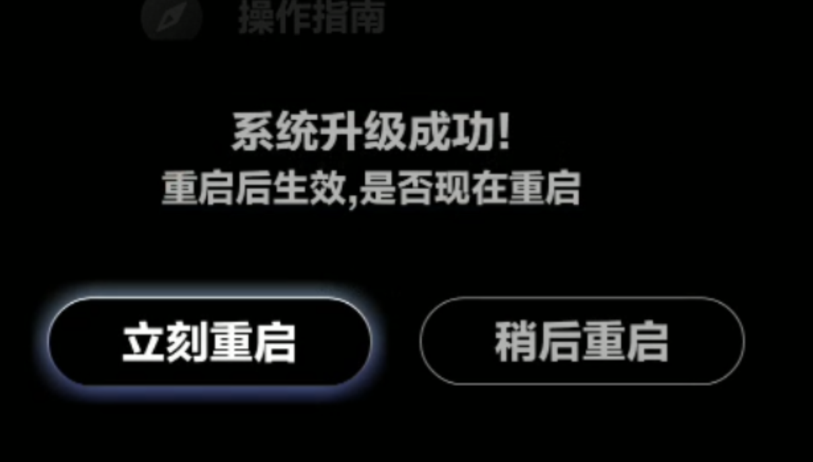

## 三、Windows连接眼镜

### 概述

* 由于win7系统内置MTP设备驱动不能自动适配二代眼镜的Dock设备，因此如需在win7系统连接Dock进行文件管理，需要手动安装兼容MTP驱动后才可正常使用。
* 绝大部分win8和win10系统能够支持MTP驱动自动安装，如此Dock连接电脑后，等待驱动自动安装完毕，即可在“此电脑”中找到Glass设备。如自动安装出现问题，也可参考第二节“操作步骤”手动安装驱动。

### 操作步骤

1. 将二代眼镜的Dock通过USB线缆连接电脑，随后鼠标右键点击“计算机”，点击设备管理器（win7系统）：

    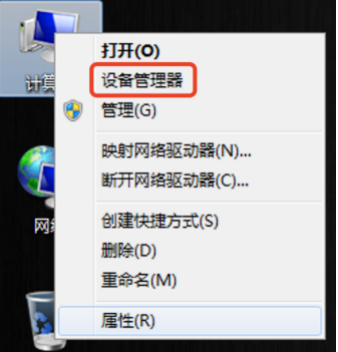

    ***注：此步骤截图为win7系统下，在win8和win10系统中，打开设备管理器需要右键点击“此电脑”，选择“管理”，并在弹出窗口左侧点选“系统工具”->“设备管理器”，右侧就会弹出“设备管理器”窗口，如下图：（后续的步骤2-13操作完全相同）***
    
    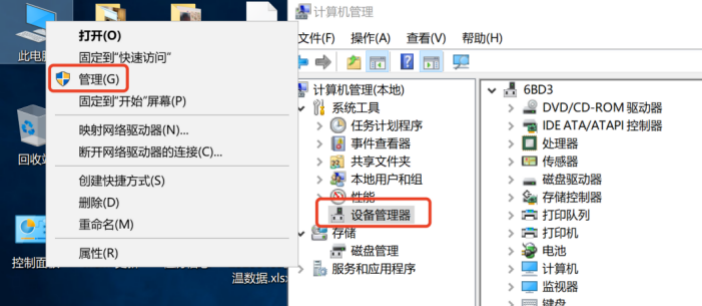

2. 此时弹出窗口内会看到：“其他设备”一栏中存在“MTP”设备，且有黄色叹号下标，说明眼镜设备已连接，但未成功识别：

    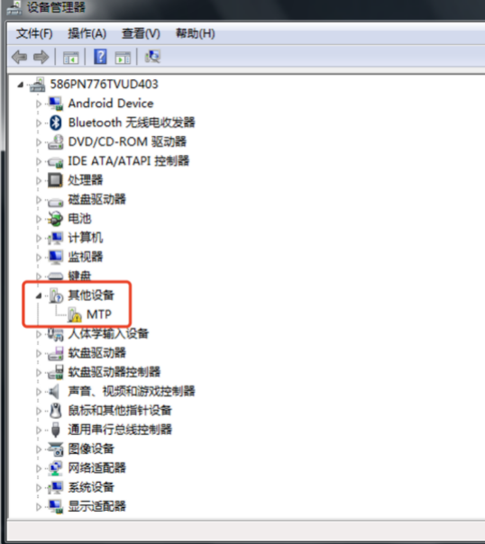

3. 鼠标在MTP菜单上点击右键，选择更新驱动程序软件：

    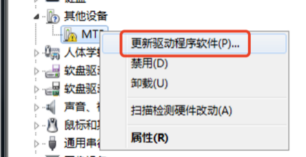

4. 在弹出界面点击选择“浏览计算机以查找驱动程序软件”，如下图红框所示：

    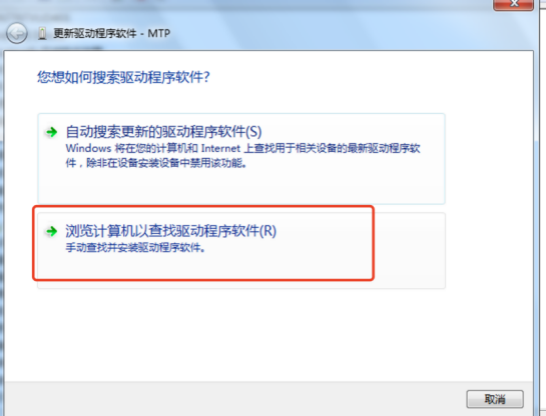

5. 在弹出的界面选择“从计算机的设备驱动程序列表中选择”，如下图红框所示：

    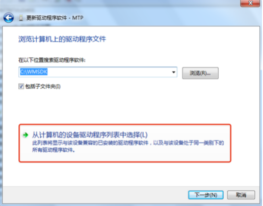

6. 拖动右侧导航按钮，找到便携设备，鼠标左键选中，然后点击“下一步”：

    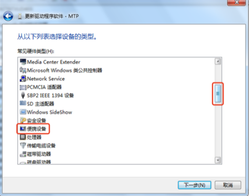
    
7. 在弹出窗口左侧厂商栏，鼠标左键点选“标准MTP设备”，随后在右侧型号栏中鼠标左键点选“MTP USB设备”，然后点击“下一步”：

    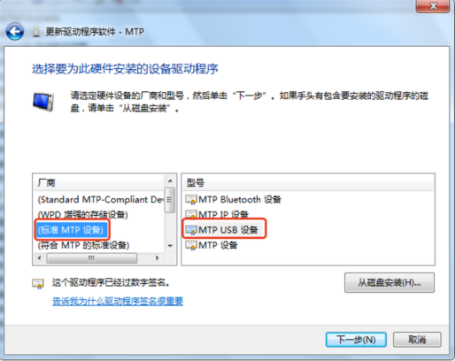
    
8. 此时会弹出驱动兼容性警告，点击“是”按钮：

    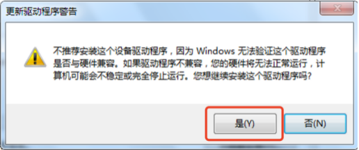

9. 随后弹出安装进度条界面，等待片刻：

    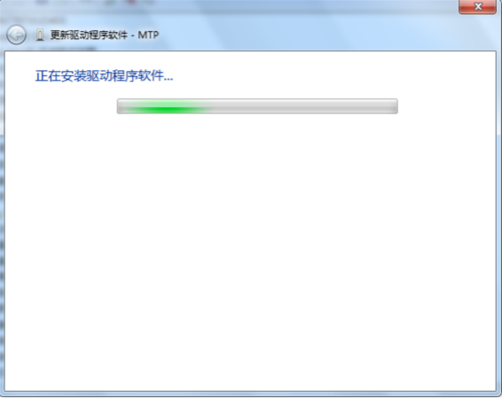
    
10. 如果安装成功，则会弹出成功界面

    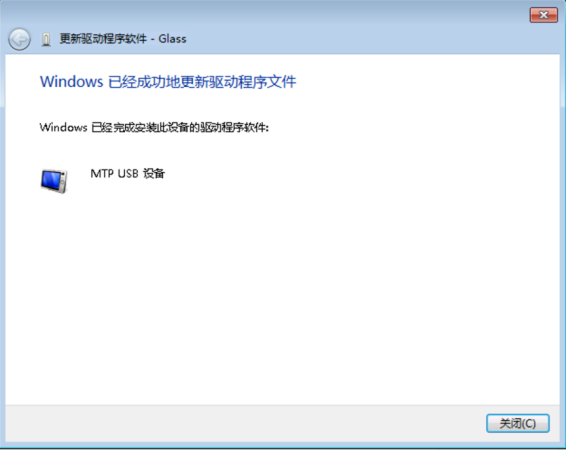
    
11. 此时设备管理器的异常MTP设备消失，出现“便携设备”，其下有“Glass”：

    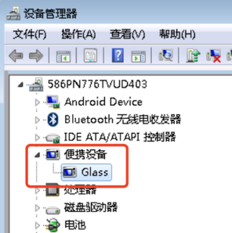
    
12. 关闭设备管理器，点击进入“计算机”，可以看到多出一个名称为“Glass”的便携设备：

    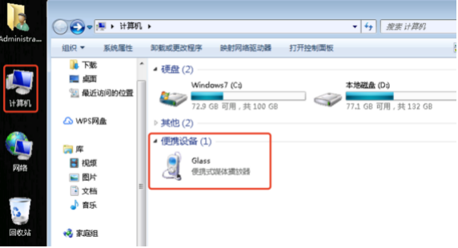
    
13. 双击Glass设备进入，就可以和正常硬盘一样，进行文件读写等操作：

    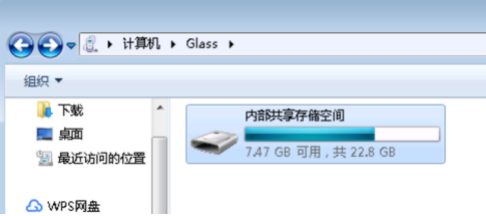
    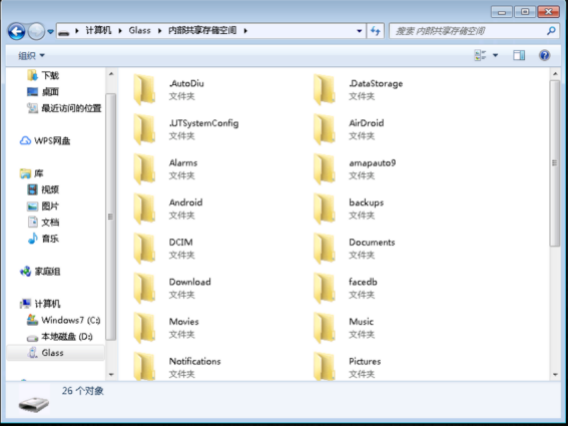
    
14. 在步骤9等待一段时间后，如果驱动安装失败，则会弹出如下界面，此时说明该系统内置驱动异常，请插拔Dock后重新操作1-9步骤。如果仍未安装成功，建议更换电脑使用，或联系技术支持人员进行协助。

    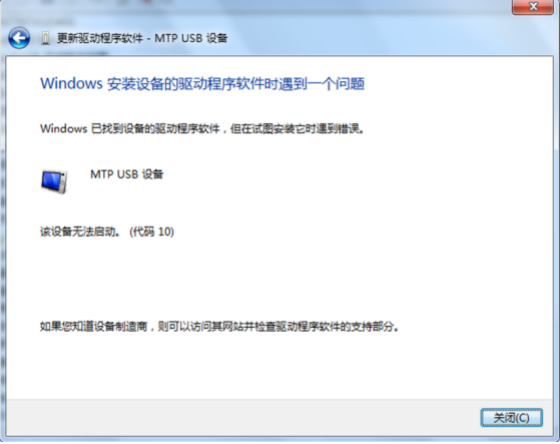


