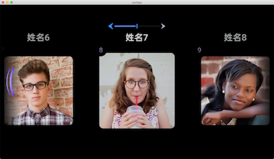

# IMU SDK


## 一、IMU SDK介绍
---
### 1.1 概述
提供在Rokid Glass上头控横向滑动的控件IMU View和自定义使用IMU功能的说明  

**1. IMU View控件**   
提供了一个可通过头控横向自动滚动的列表控件

**2. IMU 功能自定义**   
基于imu自定义头控相关功能

## 二、集成说明和版本信息
---
参照Glass UI的集成和版本更新


## 三、功能列表
---

### 3.1 IMU View

* IMU View控件：提供了一个可通过头部左右转动，控制横向自动滚动的列表控件，帮助开发者快速使用“头控快划”功能。

* 当用户打开系统设置中的“头控快划”后，你的IMU View控件就生效了。

* 示例代码：

参考GlassUI库的IMUActivity部分

#### 3.1.1 使用示例



#### 3.1.2 使用方法


```java
在Application中进行初始化：
IMUSdk.init(this);
具体使用：
getLifecycle().addObserver(mImuView);//生命周期绑定
mImuView.setSlow();//默认是快滑模式，设置此处可设置为慢滑模式
mImuView.setAdapter(mAdapter);
```

``` xml
<com.rokid.glass.imusdk.core.IMUView
        android:id="@+id/ui_recycler_view"
        imulabmarginleft="10"
        imulabmargintop="10"
        imutouchstyle="true"
        android:layout_width="match_parent"
        android:layout_height="match_parent"
        app:imuscale="1.1"
        app:imutouchstyle="true" />

```

|属性配置|含义|
|---|---|
|imuscale|配置选中Item的缩放比例|
|imupadding|配置item内填充的间距，用于预留缩放空间|
|imuspeed|配置匀速滑动模式的滑动速度|
|imuguide|配置是否显示顶部导航栏|
|imuunable|默认为false，设置为true将屏蔽imu头控功能|
|imutitlewidth|配置默认显示模板title的宽度|
|imulabmarginleft|配置左上角位置提示lab距离左边界的距离|
|imulabmargintop|配置左上角位置提示lab距离上边界的距离|
|imutouchstyle|提供两种滑动模式  true：模拟touch滑动模式 false：匀速滑动模式|
|imutouchinterval|配置模拟touch滑动模式的滑动速度|

```xml
<declare-styleable name="imuview">
    <attr name="imuscale" format="float"/>
    <attr name="imupadding" format="dimension" />
    <attr name="imuspeed" format="integer" />
    <attr name="imuguide" format="boolean" />
    <attr name="imuunable" format="boolean" />
    <attr name="imutitlewidth" format="dimension" />
    <attr name="imulabmarginleft" format="dimension" />
    <attr name="imulabmargintop" format="dimension" />
    <attr name="imutouchstyle" format="boolean" />
    <attr name="imutouchinterval" format="dimension" />
</declare-styleable>
```

#### 3.1.3 滑动模式选择

* 配置方式：通过imutouchstyle属性配置。

* 匀速滑动模式：列表进行匀速滑动，每个item不会有停顿效果，多用于内容多比较快速的滚动，类似图库。

* 模拟touch滑动模式：模拟手动touch滑动的效果，经过每个item会有停顿的效果，便于用户看清，是默认的滑动模式。

  

### 3.2 IMU 功能自定义

* 可以注册SensorManager.getDefaultSensor(Sensor.TYPE_GAME_ROTATION_VECTOR)的旋转矢量传感器类型，在onSensorChanged(SensorEvent event)回调中获取实时的方位信息，根据其每次回调内容的差值判断当前头控的状态做对应的处理。
* Android官网地址：https://developer.android.google.cn/reference/kotlin/android/hardware/SensorManager?hl=en
* 数据获取与转换：https://github.com/RokidGlass/glass-ui/blob/master/demo/src/main/java/com/rokid/glass/ui/sample/handcontrol/sensors/Orientation.java
* 使用示例代码：https://github.com/RokidGlass/glass-ui/blob/master/demo/src/main/java/com/rokid/glass/ui/sample/handcontrol/HandControlActivity.java