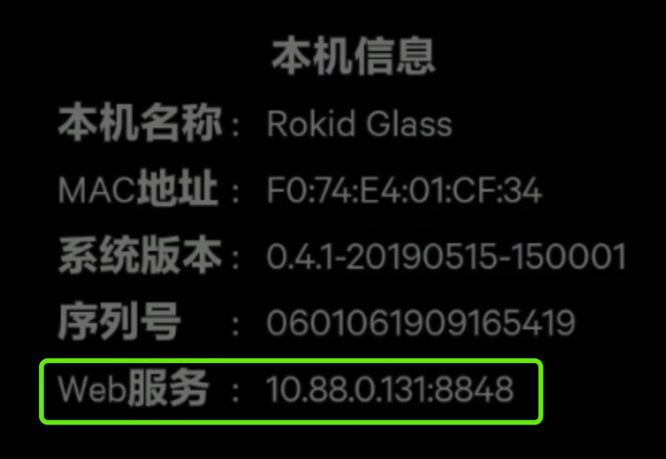
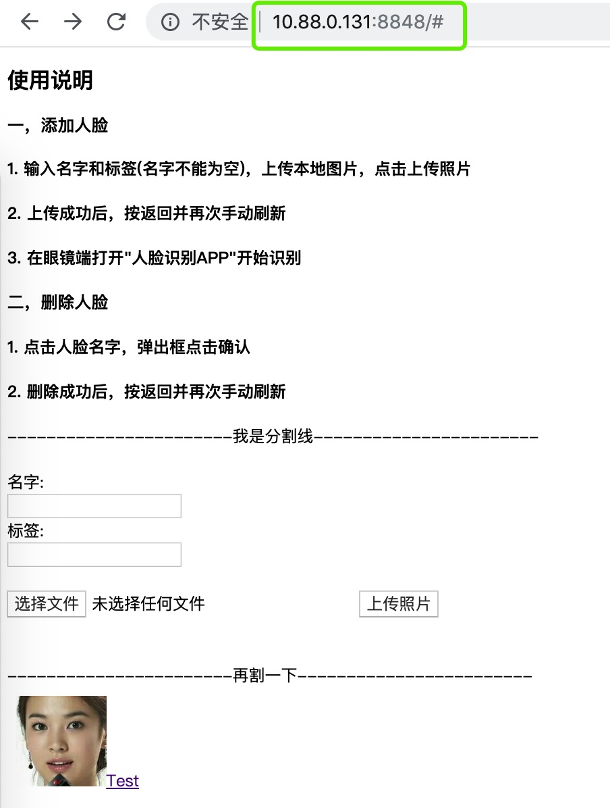
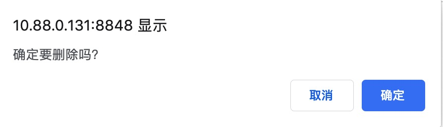

## 眼镜内嵌的HTTP服务器

### 一，使用说明
在眼镜中预置了一个轻量级的HTTP服务器，支持通过HTTP方式管理人脸特征库。

#### 1. 查看服务器地址
在眼镜开机并配网成功后，进入"设置"->“本机信息”，可以看到一个“WEB服务”的信息，如下：



这个是眼镜在局域网内的IP地址，端口号固定为8848

#### 2. 打开WEB页面
在相同局域网的PC或者手机上，打开浏览器，输入上面的服务器地址，可以看到一个人脸特征库管理页面，如下：



#### 2. 增加人脸
在表单中输入添加人脸的名字以及标签(标签可以为空)，然后选择本地的照片，最后点"上传照片"：


如果上传成功，会返回如下信息(code=200)：
```
isCover：表示当前图片是否设置成封面，这个是在公版APP中使用
uid：添加一个新用户的人脸，都有一个用户ID
uuid：表示一张新的人脸id，一个UID下可以用多个UUID，即一个用户可以添加多张人脸
```
```
{"code":200,"data":"{\"isCover\":false,\"name\":\"张三\",\"tag\":\"工程师\",\"uid\":\"b3dc18de425d486aae309529fb1e13c9\",\"uuid\":\"16b78b5b-4536-4f03-8b06-decbff84229c\"}"}
```
如果失败，也会有响应提示：
```
{"code":400,"message":"没有检测到人脸"}
```

#### 3. 删除人脸
点击人脸头像旁边的名字链接，就可以进行删除人脸的操作：




<font color=#FF0000 >PS： 不管是添加人脸还是删除人脸，返回首页后都需要手动再刷新一下页面</font>


### 二，HTTP接口说明

#### 2.1 获取用户总数(GET)
```
/get_user_num
```
###### 参数说明：
无

###### 返回结果：
```
data表示当前已经添加的用户数量
{
    "code": 200,
    "data": "2"
}
```


#### 2.2 获取用户信息，支持分页(GET)
```
/get_user_info?offset=0&limit=50
```
###### 参数说明：
| 参数名称     | 意义                         |
| -------------- | ----------------------------------------------------------------- |
| offset    | 分页起始位置               |
| limit     | 分页查询个数，如果offset和limit都不传，则返回全部结果            |
###### 返回结果：
```  
{
    "code":200,
    "data":"[{"isCover":false,"name":"张三","tag":"工程师","uid":"b3dc18de425d486aae309529fb1e13c9","uuid":"16b78b5b-4536-4f03-8b06-decbff84229c"},{"isCover":false,"name":"Test","tag":"","uid":"4b06811e9ad94ebbbf506667acc56b10","uuid":"2146d55e-2d7c-422d-b938-5a9dff8611ed"}]"
}
```


#### 2.3 添加人脸(POST)
```
/add_face
```
###### 参数说明：
请在http请求 header中加入如下参数

| 参数名称       | 意义                                                              |
| -------------- | ----------------------------------------------------------------- |
| face_name_web     | 用户名字                                 |
| face_tag_web      | 用户标签信息           |
| isCover      | 设置成"cover"表示是否设置成封面，如果只上传1张，务必设置成"cover"                             |
| uid          | 表示上传到那个用户的人脸，如果为空，表示是新用户                             |
| isSave       | 设置成"save", 表示上传的数据是否立即生效                            |

###### 返回结果：
```
{
    "code":200,
    "data":"{"isCover":false,"name":"李四","tag":"工程师","uid":"b5fbf12d02ab4dcc8ae2f393087cc87f","uuid":"b59d46c2-3d23-4571-92c7-b41d307cd59b"}"
}
```

#### 2.4 获取人脸图片(GET)
```
/get_face?uuid=xxxxxxx
```
###### 参数说明：
| 参数名称       | 意义                                                              |
| -------------- | ----------------------------------------------------------------- |
| uuid        | 数据库中人脸的uuid                      |

###### 返回结果：
返回Bitmap图片格式


#### 2.5 获取当前用户的人脸数(GET)
```
/get_user_face_num?uid=xxxxxxx
```
###### 参数说明：
| 参数名称       | 意义                                                              |
| -------------- | ----------------------------------------------------------------- |
| uid        | 用户ID                                                 |

###### 返回结果：
```
data表示当前用户下的人脸数量
{
    "code": 200,
    "data": "1"
}
```

#### 2.6 获取当前用户的人脸信息(GET)
```
/get_user_face_info?uid=xxxxxxx
```
###### 参数说明：
| 参数名称       | 意义                                                              |
| -------------- | ----------------------------------------------------------------- |
| uid        | 用户ID                                                 |

###### 返回结果：
```
{
    "code":200,
    "data":"[{"isCover":true,"uuid":"b59d46c2-3d23-4571-92c7-b41d307cd59b"}]"
}
```

#### 2.7 删除某个用户下的所有人脸数据，支持多人删除(GET)
```
/delete_user?uid=[xxx,yyy,zzz,...]&isSave=save
```
###### 参数说明：
| 参数名称       | 意义                                                              |
| -------------- | ----------------------------------------------------------------- |
| uid        | 用户ID，支持JSON数组的方式删除多个用户            |
| isSave    | 设置成“save”表示数据库立即生效                    |

###### 返回结果：
```
data字段表示剩余的用户数
{
    "code": 200,
    "data": "3"
}
```

#### 2.8 删除某个人脸特征库，支持多人脸删除(GET)
```
/delete_face?uuid=[xxx,yyy,zzz,...]&isSave=save
```
###### 参数说明：
| 参数名称       | 意义                                                              |
| -------------- | ----------------------------------------------------------------- |
| uuid        | 人脸ID，支持JSON数组的方式删除多个人脸                      |
| isSave    | 设置成“save”表示数据库立即生效                    |

###### 返回结果：
```
{
    "code": 0,
}
```

#### 2.9 更新用户信息(GET)
```
/delete_update_userface?uid=xxxxxxx&face_name=xx&face_tag=xxx&isSave=save
```
###### 参数说明：
| 参数名称       | 意义                                                              |
| -------------- | ----------------------------------------------------------------- |
| uid        | 当前需要更新的用户ID                                                 |
| face_name_web   | 用户名字                                                 |
| face_tag_web    | 用户标签                    |
| cover_uuid   | 表示更新此用户的封面图片                  |
| isSave    | 设置成“save”表示数据库立即生效                    |

###### 返回结果：
```
{
    "code": 200,
}
```

#### 2.10 保存并生效数据库
如果之前的接口参数中没有传isSave，务必在所有操作之后，调用一次/save，保证人脸识别APP可以读取到变化后的数据库。
```
/save_face
```
###### 参数说明：
无

###### 返回结果：
```
{
    "code": 200
}
```


