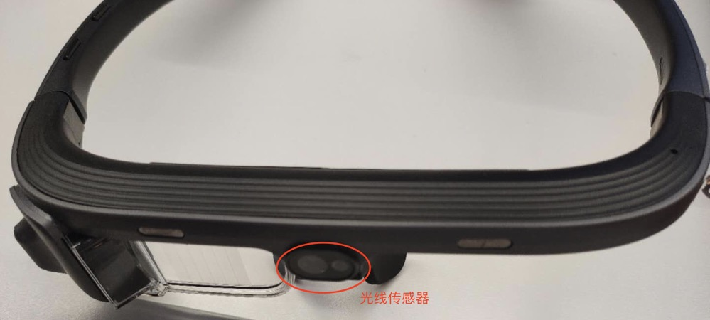
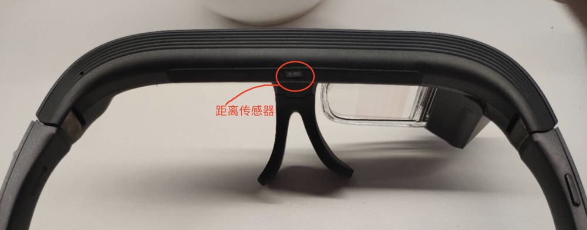
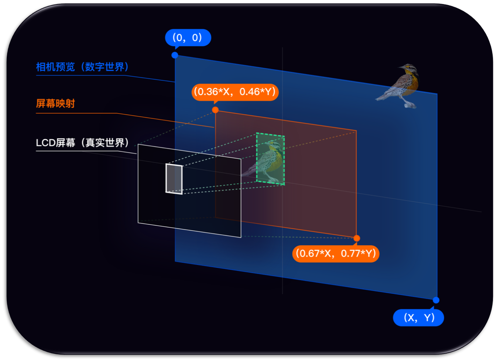

<!-- toc -->

# 眼镜硬件功能说明
此部分功能包含：
1. 眼镜信息获取
2. Camera数据获取
3. 按键、传感器事件获取

# SDK集成步骤
1. 工程build.gradle配置maven仓库地址
   
    ```groovy
    allprojects {
            repositories {
                maven { url = 'https://dl.bintray.com/rokid/alliance/' }
            }
    }
    ```
    
2. 模块build.gradle配置SDK依赖
   
    ```groovy
    implementation 'com.rokid.alliance.usbcamera:usbcamera:1.1.0.0'
    ```
    
3. SDK依赖权限如下

    ```java
    private static final String[] REQUIRED_PERMISSION_LIST = new String[]{
            Manifest.permission.WRITE_EXTERNAL_STORAGE,
            Manifest.permission.READ_EXTERNAL_STORAGE,
            Manifest.permission.RECORD_AUDIO,
            Manifest.permission.CAMERA,
            Manifest.permission.READ_PHONE_STATE,
    }
    ```
    
4. targetSdkVesion必需<=27
   
    ```groovy
    defaultConfig {
        targetSdkVersion 27
    }
    ```
    
5. SDK使用 <div id="sdk_use"></div>

    ```java
    RKGlassDevice.RKGlassDeviceBuilder
                    .buildRKGlassDevice()
                    .withGlassSensorEvent(new GlassSensorEvent() {
    
                        /**
                         * 距离传感器你
                         * @param status  true可认为是带上眼镜 唤醒光机 false可认为已摘下眼镜 熄灭光机
                         */
                        @Override
                        public void onPSensorUpdate(final boolean status) {
                            RKGlassDevice.getInstance().setBrightness(status ? 100 : 0);//可以根据距离传感器来判断眼镜是否处于佩戴状态，来调整光机的亮度节能
                            lSensorBar.setProgress(status ? 100 : 0);
                            tvPSensor.post(() -> tvPSensor.setText("距离传感器状态: " + status));
                        }
    
                        /**
                         * 前置光线传感器
                         * @param lux 最小值为0
                         */
                        @Override
                        public void onLSensorUpdate(final int lux) {
                            tvLSensor.post(() -> tvLSensor.setText("光线传感器: " + lux));
                        }
                    })
                    .withRKKeyListener(new RKKeyListener() {
    
                        /**
                         * 电源键键事件
                         * @param eventType {@link KeyEventType}
                         */
                        @Override
                        public void onPowerKeyEvent(final int eventType) {
                            tvPower.post(() -> tvPower.setText("电源键事件: " + eventToString(eventType)));
                        }
    
                        /**
                         * 回退键事件
                         * @param eventType {@link KeyEventType}
                         */
                        @Override
                        public void onBackKeyEvent(final int eventType) {
    
                            tvBack.post(() -> tvBack.setText("回退键事件: " + eventToString(eventType)));
                        }
    
                        /**
                         * 触控板事件
                         * @param eventType {@link RKGlassTouchEvent}
                         */
                        @Override
                        public void onTouchKeyEvent(final int eventType) {
    
                            tvTouch.post(() -> tvTouch.setText("TouchBar事件: " + eventToString(eventType)));
                        }
    
                        /**
                         * 触控板向后滑动
                         */
                        @Override
                        public void onTouchSlideBack() {
    
                            tvSlide.post(() -> tvSlide.setText("向后滑动"));
                        }
    
                        /**
                         * 触控板向前滑动
                         */
                        @Override
                        public void onTouchSlideForward() {
    
                            tvSlide.post(() -> tvSlide.setText("向前滑动"));
                        }
                    })
                    .build()
                    .initUsbDevice(this, mPreview, new OnGlassConnectListener() {
    
                        /**
                         * 当用户授权眼镜权限后 将回调
                         * @param usbDevice {@link UsbDevice}
                         * @param glassInfo {@link GlassInfo}
                         */
                        @Override
                        public void onGlassConnected(UsbDevice usbDevice, GlassInfo glassInfo) {
                            tvDeviceInfo.post(() -> tvDeviceInfo.setText("Glass信息：vendorId:" + usbDevice.getVendorId()
                                    + " productId: " + usbDevice.getProductId() + " deviceName: "
                                    + usbDevice.getDeviceName() + " SN: " + glassInfo.getSn()));
    
                            lSensorBar.setProgress(RKGlassDevice.getInstance().getBrightness());
                            lSensorBar.setOnSeekBarChangeListener(new SeekBar.OnSeekBarChangeListener() {
                                @Override
                                public void onProgressChanged(SeekBar seekBar, int progress, boolean fromUser) {
                                    // 调整光机亮度 范围0~100
                                    RKGlassDevice.getInstance().setBrightness(progress);
                                }
    
                                @Override
                                public void onStartTrackingTouch(SeekBar seekBar) {
    
                                }
    
                                @Override
                                public void onStopTrackingTouch(SeekBar seekBar) {
    
                                }
                            });
                        }
    
                        /**
                         * 当眼镜断开连接时
                         */
                        @Override
                        public void onGlassDisconnected() {
                            tvDeviceInfo.post(() -> tvDeviceInfo.setText("Glass断开连接"));
                        }
                    });
    ```

6. sdk释放
   
    ```java
    RKGlassDevice.getInstance().removeOnPreviewFrameListener(onPreviewFrameListener);
RKGlassDevice.getInstance().deInit();
    ```


# 眼镜连接Android主机信息说明
**如果对USB主机不熟悉请先阅读[USB主机](https://developer.android.com/guide/topics/connectivity/usb/host?hl=zh-cn)**

## 如何鉴别UsbDevice为Rokid眼镜

 字段 | 类型 | 值 | 说明
 ---- | ---- | ---- | ---- 
VendorId | int | 1234 | 通过UsbDevice#getVendorId()获取
ProductId | int | 5678 | 通过UsbDevice#getProductId()获取

## 获取眼镜其他信息 <div id="获取眼镜其他信息"></div>
**[获取方式](#sdk_use)**，在`RKGlassDevice#initUsbDevice(...)`回调函数中，我们可以获取到眼镜的基本信息`GlassInfo`，字段说明如下：

字段 | 类型 | 说明
--- | --- | ---
sn  | String | 区分眼镜唯一标识序列号
typeId | String | 设备TypeId
pcba | String | 设备PCBA编码
vSyncStatus | boolean | 设备VSync状态
opticalId | String | 可区分眼镜生产批次，其值目前有三个，分别是"1"、"2"、"3"

**注意：**opticalId区分眼镜批次后主要用于alignment对齐。alignment对齐可以理解为当对现实场景进行标注时，应用在眼镜屏幕的标注点与实际人眼看到的位置不一样，因此需要对屏幕标注的位置进行调整。根据眼镜生产批次的不同（我们认为同一批次的眼镜调整系数是一样的），通过opticalId进行区分。

# 摄像头数据
摄像头数据获取基于第三方开源库[UVCCamera](https://github.com/jiangdongguo/AndroidUSBCamera)封装，UVC全称：`USB Video Class`，可以认为就是外接摄像头。

## 获取方式
1. [初始化](#sdk_use)
2. 监听camera数据回调
   
    ```java
     RKGlassDevice.getInstance().setOnPreviewFrameListener(bytes -> {
            //TODO
        });
    ```
3. 取消camera数据回调
   
    ```java
    RKGlassDevice.getInstance().removeOnPreviewFrameListener(AbstractUVCCameraHandler.OnPreViewResultListener: onPreviewFrameListener);
    ```

# 眼镜按键
眼镜按键包括回退键、电源键、触控板。

## 按键监听
 **[获取方式](#sdk_use)**


## 按键说明
按键类型一般分为`单击`、`双击`及`长按`类型，除此之外，触控板增加了`向前滑动`和`向后滑动`事件。

```java
public interface RKKeyListener {

    /**
     * 电源键键事件
     * @param eventType {@link KeyEventType}
     */
    void onPowerKeyEvent(@KeyEventType int eventType);

    /**
     * 回退键事件
     * @param eventType {@link KeyEventType}
     */
    void onBackKeyEvent(@KeyEventType int eventType);

    /**
     * 触控板事件
     * @param eventType {@link RKGlassTouchEvent}
     */
    void onTouchKeyEvent(@KeyEventType int eventType);

    /**
     * 触控板向后滑动
     */
    void onTouchSlideBack();

    /**
     * 触控板向前滑动
     */
    void onTouchSlideForward();

}
@IntDef(value = {KeyEventType.SINGLE_CLICK, KeyEventType.DOUBLE_CLICK, KeyEventType.LONG_CLICK})
public @interface KeyEventType {

    /**
     * 单击事件
     */
    public static final int SINGLE_CLICK =1;

    /**
     * 双击事件
     */
    public static final int DOUBLE_CLICK =2;

    /**
     * 长按事件
     */
    public static final int LONG_CLICK =3;
}
```


# 传感器
眼镜目前包含前置光线传感器和后缀距离传感器。

## 光线传感器

### 位于眼镜位置



### 获取光线传感器事件
 **[获取方式](#sdk_use)**

## 距离传感器

### 位于眼镜位置



### 获取距离传感器事件
**[获取方式](#sdk_use)**


# 眼镜亮度调整
光机亮度调整的范围是[0,100]。建议配合距离传感器和光线传感器使用。

## API
```java
RKGlassDevice.getInstance().setBrightness(int: brightness);
int brightness = RKGlassDevice.getInstance().getBrightness();
```


# Aligment对齐


##  Alignment概念

Camera预览界面通过Glass显示屏幕进入人眼睛的映射过程.

* 在手机上开发如下图：


* 在眼镜上开发如下图：



1. 蓝色代表`相机预览`的画面
2. 绿色代表`相机预览`中物体的坐标
3. 橙色代表`LCD屏幕`在`相机预览`的映射区域,百分比表示真实世界在虚拟世界的比例
4. 白色代表物体映射到`LCD屏幕`的显示区域


## 获取Alignment

以下示例针对矩形框进行Alignment校准，如果是其他形状请参考以下示例进行校准：

```java
Rect rect = new Rect(20, 20, 100, 100);//相机预览Rect位置，比如人脸识别使用Camera数据进行人脸检测后得到的人脸框，这个人脸框绘制到眼镜屏幕上需要进行校准，真实的位置需要根据眼镜硬件的生产批次进行位置调整

//PREVIEW_WIDTH和PREVIEW_HEIGHT为屏幕的分辨率，ROKID二代眼镜分辨率是1280*720，rect为待校准的人脸框，返回校准后的人脸框，这个人脸框就是最终绘制到屏幕的区域
Rect rectAfterAlignment = RokidSystem.getAlignmentRect(PREVIEW_WIDTH, PREVIEW_HEIGHT, rect);
```

