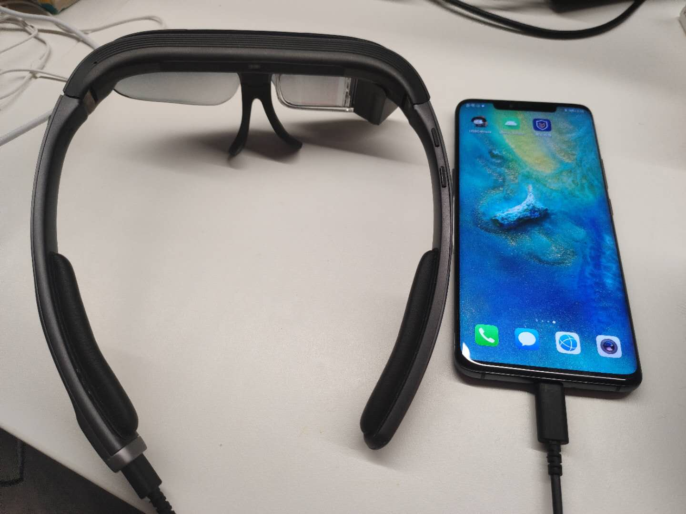
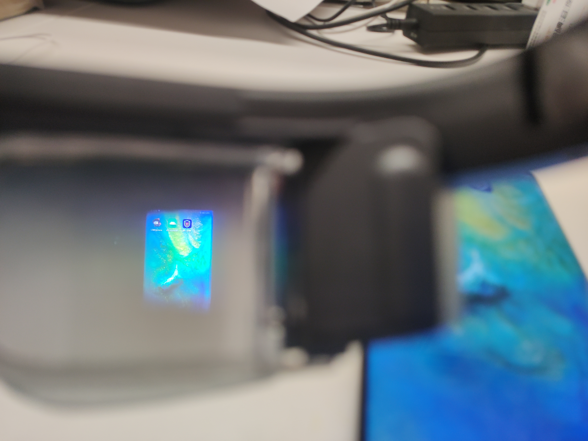

<!-- toc -->        

# 简介

**眼镜连接手机方案**可实现能力：`Camera数据`、`按键事件`、`传感器事件`、`麦克风数据`、`离线指令`、`双屏异显`。

# 快速上手

请确认使用眼镜+手机方案需实现功能，再从以下方案中选择合适的接入方式。

1. [使用眼镜硬件能力(Camera数据、按键事件、传感器事件、双屏异显)眼镜硬件功能](glass_hardware.md#简介)
2. [使用眼镜硬件能力+人脸识别、车牌识别](glass_recog_sdk.md)

# 最佳实践

**[下载Demo工程](https://static.rokidcdn.com/sdk/sdk_glassmobile_demo-0cb21d0.zip)**

# 附录

以下开发知识点如不熟悉请参考相应链接进行学习了解。

1. [USB主机](https://developer.android.com/guide/topics/connectivity/usb/host?hl=zh-cn)
2. [UVCCamera](https://github.com/jiangdongguo/AndroidUSBCamera) UVC全称：`USB Video Class`，可以认为就是外接摄像头
3. [双屏异显](https://developer.android.com/reference/android/app/Presentation)

# 使用限制

眼镜作为USB设备双屏异显对手机机型有限制（各手机厂商对双屏异显实现不一致），**目前仅支持华为部分支持DP输出机型（Mate10、Mate20、Mate30及对应Pro机型**。
支持手机必备条件（_可直接进行下面第三个步骤确认手机是否支持）
    
 1. 手机数据接口为TypeC接口
 2. 手机支持DP输出
 3. **以下条件任意一条不满足的手机都表明不支持此机型**
    1. 是否正常供电：将眼镜盒手机使用数据线连接，带上眼镜，确认眼镜屏幕是否点亮。 
    2. 显示是否正常：查看眼镜显示画面是否正常，一般显示界面是手机界面的镜像显示 
       
    

