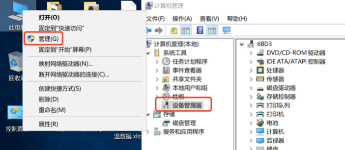
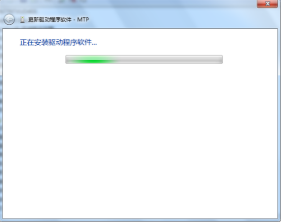
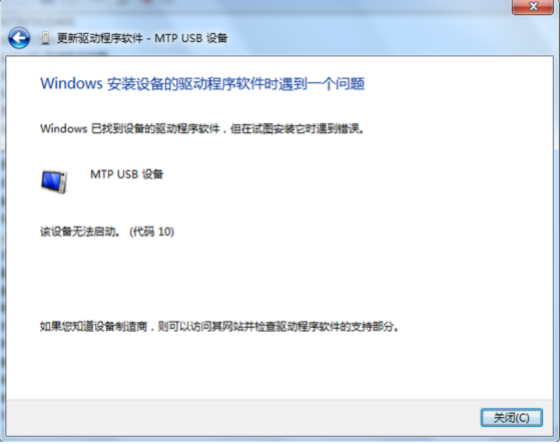

# Rokid Glass 软件开发文档

## 一、介绍
-   本文档面向Rokid Glass的开发者，介绍了开发者如何在Rokid Glass上开发应用。   
-   本文档包含了系统信息，开发指南，Rokid Glass SDK使用文档及示例，OS设计规范，FAQ和论坛。
-   详细页面跳转请点击gitbook左上角“目录”。

## 二、系统信息说明
### 基本信息
|名称|简介|
|---|---|
| AP | Amlogic-S905D3|
| RAM |2G|
| ROM |32G|
| IMU |9轴，支持ROTATION_VECTOR|
| Camera |拍照最大分辨率3264x2448，录像1080p@30fps|
| 屏幕 | 分辨率1280x720，横屏，320dpi|
| 基于Android9.0 |开发工具AndroidStudio|
| 交互方式 |[触摸板、按键](1-system/index.md)、语音、头控|

## 三、简要开发指南
* **眼镜开发和安卓开发的区别：**
  * Glass没有触摸屏，只有触摸板，部分类型的控件需要自定义焦点控制。
  * Glass上建议可以不显示相机预览（preview），因为AR眼镜可透视真实世界。具体实现可参考[相机映射](2-sdk/5-ui-sdk/index.md#三、功能列表)
  * Glass风格的UI：参考[UI设计规范](5-design/index.md)和[UI SDK](2-sdk/5-ui-sdk/index.md)。
  * 如果需要使用系统内置的AR录屏功能，并需要叠加Camera预览作为录屏背景，需注意：
	* App使用Camera API2接口；
	* 需要叠加Camera预览的Activity，开启时需发送广播 ``android.intent.action.CAMERA_WALLPAPER_START_PREVIE``
	* 结束时发送广播 ``android.intent.action.CAMERA_WALLPAPER_STOP_PREVIE``

* **眼镜开发的步骤：**
  1. 新建Android工程，或者基于现有的Android工程改造。
  2. 按照Android TV的开发模式，用Glass触摸板控制焦点变化（可以参考[触摸板键值说明](1-system/index.md)）。 **恭喜你！可以在眼镜上用触摸板使用自己的App了！**
  3. 可以使用提供的**基础SDK**进行Glass语音和头控的交互方式进行开发。
  4. 根据应用场景，可以选择对应的**功能SDK**来加快开发速度。

## 四、SDK简介和下载
### 基础SDK
|名称|简介|
|---|---|
| [Glass UI](2-sdk/5-ui-sdk/index.md) | 1. 提供一套在Rokid Glass上开发应用的基础UI库 2. 真实世界和相机预览（Preview） 之间的关系以及相机映射(alignment) |
| [语音交互](2-sdk/3-voice-sdk/InstructSdk/InstructSdk.md)| 可以通过集成离线语音sdk，使用系统内置的语音助手控制Rokid Glass|

### 功能SDK
|名称|简介|
|---|---|
| [人脸离线识别](2-sdk/1-face-sdk/index.md) | 人脸识别SDK接入和接口说明|
| [人脸在线识别](2-sdk/1-face-online-sdk/index.md)| 人脸在线识别的接口规范和使用|
| [车牌识别](2-sdk/2-lpr-sdk/index.md)|车牌识别提供车牌检测+车牌识别功能 |

## 五、Windows连接眼镜

### 概述

由于win7系统内置MTP设备驱动不能自动适配二代眼镜的Dock设备，因此如需在win7系统连接Dock进行文件管理，需要手动安装兼容MTP驱动后才可正常使用。
绝大部分win8和win10系统能够支持MTP驱动自动安装，如此Dock连接电脑后，等待驱动自动安装完毕，即可在“此电脑”中找到Glass设备。如自动安装出现问题，也可参考第二节操作步骤手动安装驱动。

### 操作步骤

1. 将二代眼镜的Dock通过USB线缆连接电脑，随后鼠标右键点击“计算机”，点击设备管理器（win7系统）：

    

    ***注：此步骤截图为win7系统下，在win8和win10系统中，打开设备管理器需要右键点击“此电脑”，选择“管理”，并在弹出窗口左侧点选“系统工具”->“设备管理器”，右侧就会弹出“设备管理器”窗口，如下图：（后续的步骤2-13操作完全相同）***
    
    

2. 此时弹出窗口内会看到：“其他设备”一栏中存在“MTP”设备，且有黄色叹号下标，说明眼镜设备已连接，但未成功识别：

    

3. 鼠标在MTP菜单上点击右键，选择更新驱动程序软件：

    

4. 在弹出界面点击选择“浏览计算机以查找驱动程序软件”，如下图红框所示：

    

5. 在弹出的界面选择“从计算机的设备驱动程序列表中选择”，如下图红框所示：

    

6. 拖动右侧导航按钮，找到便携设备，鼠标左键选中，然后点击“下一步”：

    
    
7. 在弹出窗口左侧厂商栏，鼠标左键点选“标准MTP设备”，随后在右侧型号栏中鼠标左键点选“MTP USB设备”，然后点击“下一步”：

    
    
8. 此时会弹出驱动兼容性警告，点击“是”按钮：

    

9. 随后弹出安装进度条界面，等待片刻：

    
    
10. 如果安装成功，则会弹出成功界面

    
    
11. 此时设备管理器的异常MTP设备消失，出现“便携设备”，其下有“Glass”：

    
    
12. 关闭设备管理器，点击进入“计算机”，可以看到多出一个名称为“Glass”的便携设备：

    
    
13. 双击Glass设备进入，就可以和正常硬盘一样，进行文件读写等操作：

    
    
    
14. 在步骤9等待一段时间后，如果驱动安装失败，则会弹出如下界面，此时说明该系统内置驱动异常，请插拔Dock后重新操作1-9步骤。如果仍未安装成功，建议更换电脑使用，或联系技术支持人员进行协助。

    

